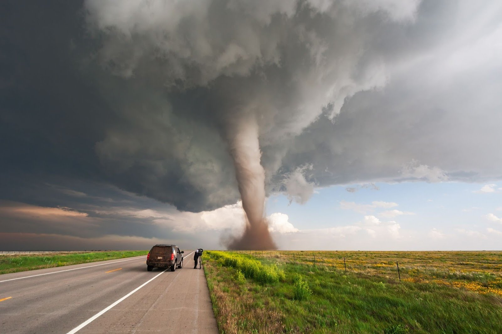

**100/365 Tornado** este unul din cele mai înfricoşătoare şi totodată spectaculoase fenomene naturale. Acesta poate atinge viteza de 480km şi lasă din urma sa moarte şi ravagii. Puterea unui tornado se măsoară pe scara lui Fudzito, dezvoltată de omul de ştiinţă Tetsuya Theodore Fujita în anul 1971, astfel cel mai distrugător tornado atinge pe scara Fujita gradaţia F12, iar viteza unui tornado în acest moment depăeşteş viteza de 512km. Interesant că majoritatea tornadelor se formează pe teritoriul Statelor Unite ale Americii, deşi rareori se formează totuşi şi pe teritoriile altor continente. Unul din cele mai distrugătoare tornado a avut loc în anul 1925 în SUA, Missouri. Acesta avea o viteză de circa 350km/h şi a "vizitat" statele Illinois şi Indiana. În unele locuri, acesta a lăsat urme cu lăţimea de până la 1,5km şi a cauzat circa 700 decese. În Bangladeş, în anul 1989 un tornado a cauzat moartea a peste 1300 de oameni. Interesant este şi faptul că în timpul războiului pentru independenţă în SUA (1775 – 1783), când englezii au incendiat la Washington câteva clădiri cum ar fi Casa Albă, Capitoliul şi altele, ploile au stins incendiile, iar tornado a omorât mai mulţi soldaţi englezi decât armele americanilor. Alt fapt interesant este că tornadele care se formează în partea de sud a planete se rotesc în sensul acelor de ceasornic, iar în partea de nord - în direcţie inversă. Culoarea unui tornado variază în dependenţă de locaţia acestuia. Spre exemplu, tornado care se formează pe suprafaţa unui ocean, are de obicei culoarea albastră, iar un tornado care poate fi văzut la asfinţit are culoarea portocalie, galbenă sau rozovă.

