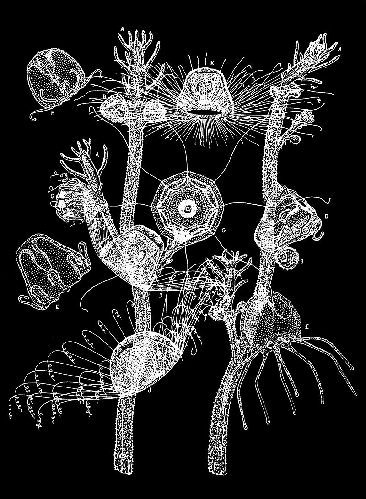

**101/365 Turritopsis dohrnii** sau meduza nemuritoare este o meduză mică care se întâlneşte în Marea Mediterană şi în apele Japoniei. Este unica vietate cunoscută care poate să se reîntoarcă la stadiul de imaturitate sexuală după ce l-a atins deja. Un adult este capabil să revină la stadiul de polip, apoi să reia procesul de maturizare. Acest fapt se întâmplă atunci când meduzele sunt vătămate, iar celulele ei revin pas cu pas la stadiul de dezvoltare primar. Apoi începe o viaţă nouă, redevenind un exemplar identic cu precedentul. Este ca şi cum un om matur ar reveni la stadiul de embrion, după care se maturizează din nou. Teoretic, acest proces ar putea dura la infinit, aşa că aceste meduze nu mor niciodată, decât doar dacă nu sunt mâncate de prădători.

