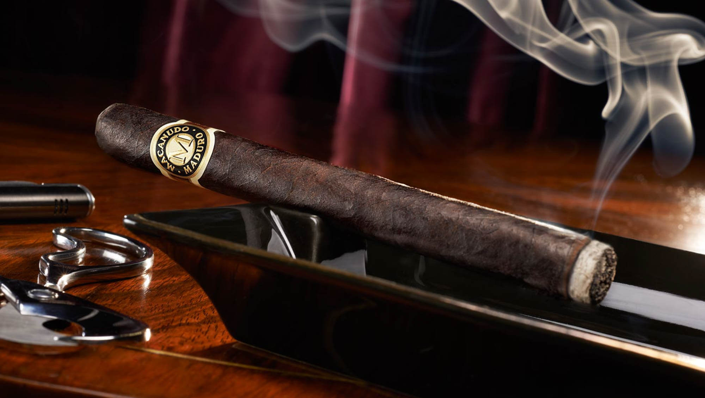

**102/365** Un american şi-a cumpărat o cutie cu câteva trabucuri scumpe şi fiind îngrijorat de soarta acestora, le-a asigurat de pojar. Peste o lună trabucurile deja s-au terminat, însă americanul nici măcar nu a achitat taxele pentru asigurare. Domnul s-a adresat la compania de asigurări declarând că trabucurile au ars în urma unor "pojaruri mici". Compania a refuzat să-i achite, spunându-i că trabucurile au fost folosite în cel mai normal mod. Domnul s-a adresat în judecată şi a câştigat cazul. Judecătorul a afirmat că cererea e absurdă, dar totuşi trabucurile au fost asigurate de foc, iar asigurarea nu determina în ce mod acestea trebuie sau nu să ardă. Astfel compania de asigurări a achitat clientului 15.000$ pentru trabucurile arse. Totuşi, americanul nu a reuşit să se bucure prea mult de bani, deoare imediat după ce a primit banii, a fost arestat. Pe baza aceeaşi asigurări, domnul a fost acuzat de distrugerea intenţionată a 24 de trabucuri. Rezultatul procesului - 24 luni de închisoare şi 24.000$ amendă.

