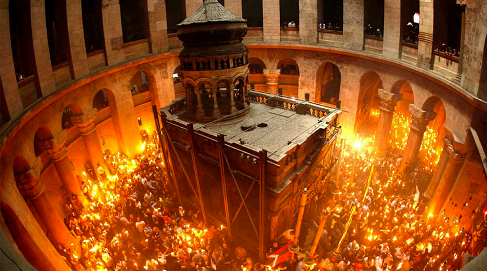

**103/365** Deşi deja suntem în secolul 21, deşi chimia şi fizica sunt obiecte de studiu obligatoriu în şcoli, deşi omenirea nu a mai avut mai mult acces la informaţie ca în zilele noastre, totuşi zeci şi sute de milioane de oameni continuă să fie îndobitociţi de unii indivizi îmbrăcaţi în rochii negre, care îşi sărută mâinile unul altuia. În fiecare an, înainte de a se sărbători Paştele (sărbătoarea evreilor în cinstea eliberării din robia egipteană), în cinstea învierii lui Iisus (cu toate că în Biblie Iisus le porunceşte ucenicilor săi ca aceştia să sărbătorească moartea sa care a însemnat eliberarea oamenilor din păcat), oamenii aşteaptă "minunea" focului haric care se petrece de circa 1.000 de ani. Aceasta reprezintă aprinderea unei candele sfinte de la care mai apoi preotul aprinde alte 33 de lumânări. Interesant este faptul că acest lucru se petrece într-o încăpere specială, unde oamenii nu au acces şi nu pot vedea cum se aprinde candela. Totuşi, chiar dacă acest lucru s-ar petrece într-un spaţiu deschis, să nu uităm că fosforul alb intră în reacţie cu oxigenul şi poate lua foc chiar şi la temperatura camerei.
"Doar două lucruri sunt infinite, universul şi prostia umană, însă nu sunt sigur despre primul." Albert Einstein

