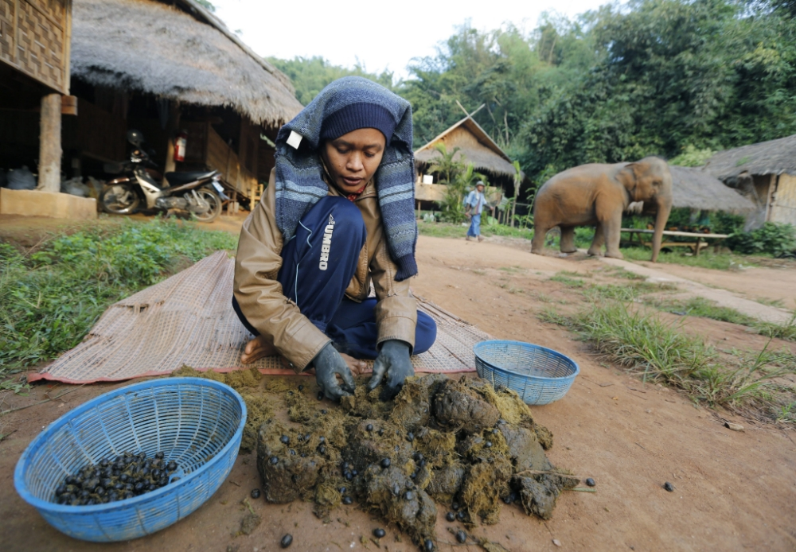

**104/365 Kopi Luwak şi Black Ivory** sunt cele mai scumpe tipuri de cafea, acestea costă mai mult de 1.000$ pentru un kilogram. Totuşi, nu preţul este faptul prin care aceste două tipuri de cafea ies în evidenţă, ci modul în care sunt preparate.
Spre exemplu, pentru a produce tipul de cafea Kopi Luwak, boabele coapte sunt mâncate de pisica indoneziană, care trecând prin stomacul acesteia, pierd din gustul amar, devenind mai moale. După aceasta, boabele de cafea sunt extrase din excremente, prelucrate şi vândute.
Pentru a produce tipul de cafea Black Ivory, elefanţii sunt hrăniţi cu câteva zeci de kilograme de boabe de cafea împreună cu mâncarea lor obişnuită (banane, trestie de zahăr), care la fel datorită faptului că trec prin stomacul animalului, le dă acestora un gust şi o aromă de fructe. Pentru a obţine un kg de cafea Black Ivory, e nevoie ca de circa 30kg de boabe.

