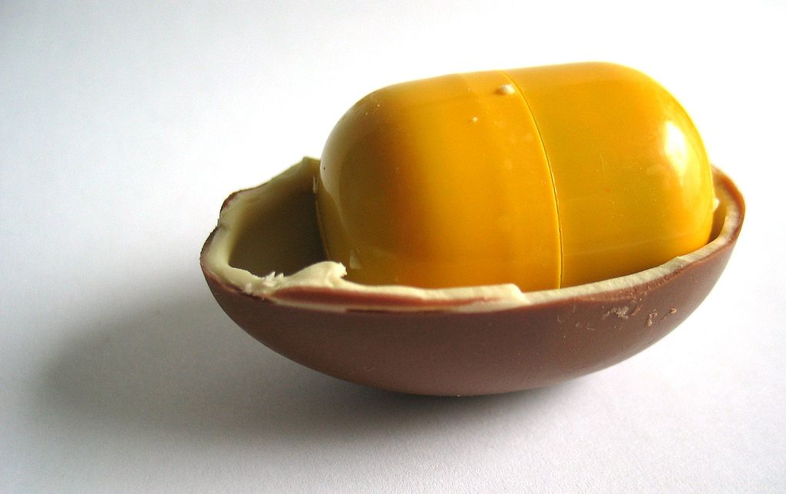

**105/365** De **Kinder Surprise** ştie fiecare din noi. Un on din ciocolată cu o jucărie înăuntrul său e dorinţa nu doar a multor copii, ci şi a unor maturi, care le colecţionează. Marca înregistrată aparţine companiei italiene Ferrero, iar prima apariţie a oului de ciocolată are loc în anul 1974 şi purta numele de Kinder Sorpresa. Ideea îi aparţine lui William Salice, care a lucrat în companie 40 de ani. Designul jucăriilor este creat atât de oameni din companie cât şi de liberi profesionişti şi sunt confecţionate de câteva companii din întreaga lume. Pe parcursul timpului au fost create diferite colecţii de jucării, iar unele din ele ajung să fie căutate şi scumpe. Interesant este şi faptul că în unele ouă pot fi găsite unele coduri pentru a putea descărca jocuri de pe internet. 
Kinder Surprise a fost interzis în SUA până în anul 2013. conform unei legi din anul 1938, care interzicea comercializarea produselor alimentare care conţin şi elemente necomestibile. Astfel, există riscul ca elementele mici pot fi înghiţite de copii, fapt care ar pune în pericol viaţa şi sănătatea lor. În Chile însă, din acelaşi an, 2013, a fost interzisă comercializarea ouălelor Kinder Surprise copiilor cu vârsta mai mică de 14 ani.

