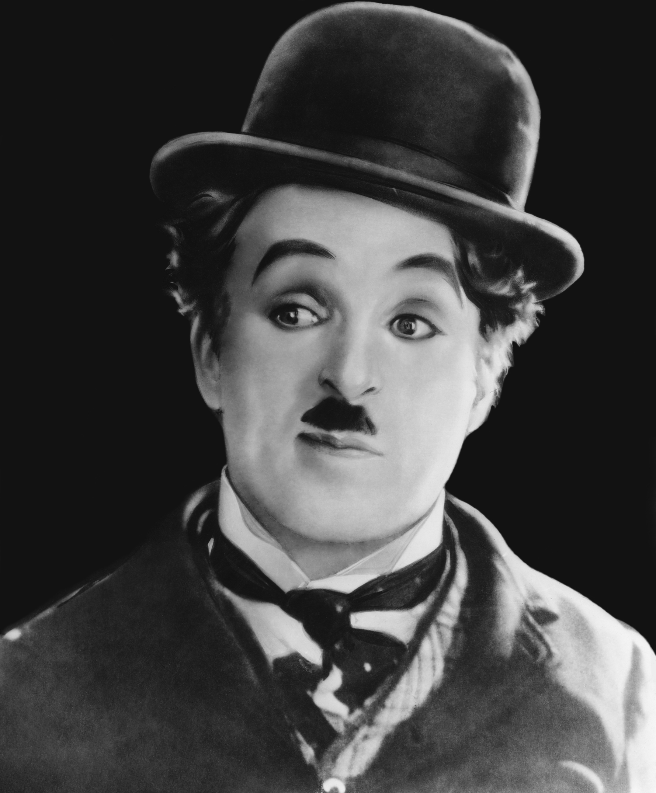

**106/365** La 16 aprilie 1889, la Londra, se naşte **Charlie Chaplin**, unul din cele mai cunoscute figuri ale secolului XX. Când avea doar şapte ani, părinţii săi au divorţat, iar doar peste câteva luni mama lui Charlie a suferit o cădere nevroasă şi a fost internată într-un sanatoriu. Viaţa săracă pe care o ducea, îl face să se alăture unui grup de dansatori cu care are ocazia să apară pe scenă. Mai târziu, cu o altă trupă de dansatori, pleacă într-un tur în America între anii 1910 - 1912, după care revine în Anglia pentru o perioadă de 5 luni, dar se hotărăşte să se întoarcă înapoi în SUA pentru a se stabili acolo. În timpul unei prezentări, este observat de Mack Sennett, cu care semnează un contract şi este plătit cu 150$ pe săptămână. În 1916 semnează un contract cu compania Mutual Film Corporation pentru suma de 670.000$ anual, astfel devenind unul din cei mai bine plătiţi oameni din lume. Pe parcursul vieţii sale este căsătorit de câteva ori şi a avut 10 copii. Cu ultima sa soţie s-a căsătorit când el avea 54 de ani, tot atâta cât avea şi tatăl soţiei sale, Oona O'Neill, în vârstă de doar 18 ani. Au avut împreună opt copii. A decedat la vârsta de 88 de ani în Elveţia, acolo unde a trăit ultimii săi 24 de ani. Interesant este faptul că Charlie Chaplin a participat la un concurs de sosii ale sale, nefiind cunoscut de nimeni, şi a luat doar locul trei. Un alt fapt interesant legat de Charlie s-a întâmplat după moartea acestuia. Hoţii i-au furat corpul neînsufleţit din mormânt şi cereau o recompensă, iar în caz că nu au să primească banii. ameninţau să-l distrugă. După 11 săptămâni, aceştia au fost prinşi, iar trupul său a fost întors la loc, doar că de data aceasta, mormântul a fost betonat, ca nimeni să nu-l mai poată fura.

