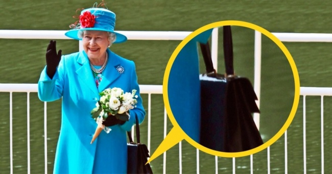

**107/365 Regina Elizabeta II** întotdeauna iese în public cu o gentuţă micuţă pe care o poartă pe braţ. Pe lângă oglindă, ruj, pix şi câteva bomboane mentolate, ea mai poartă gentuţa pentru a putea "comunica" în caz de necesitate cu personalul. Spre exemplu, dacă regina mută gentuţa dintr-o mână în alta, în timp ce discută, e un semn că discuţia trebuie să sfârşească cât mai curând. Totuşi, acest lucru se face atât de tacticos, că gestul o să rămână practic neobservat. Dacă regina pune gentuţa pe masă în timp ce mănâncă, ea dă de înţeles că ar dori ca în următoarele 5 minute ceremonia să se sfârşească. Dacă regina pune gentuţa pe podea, atunci ea dă de înţeles că nu are mare plăcere de la discuţie, şi ar fi bine ca cineva din personal să o scoată din încurcătură. Sper totuşi, că dacă o să aveţi ocazia să discutaţi cu regina, ea să nu fie nevoită să folosească reţetele secrete de a o încheia.

