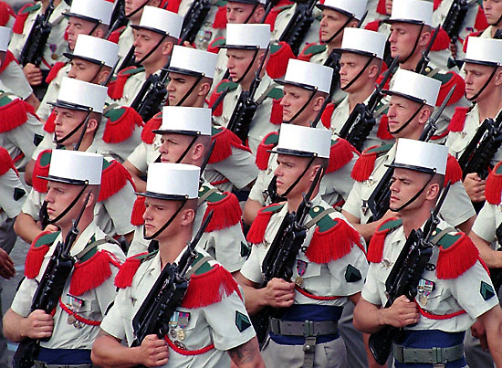

**108/365 Legiunea Franceză** a fost formată la 9 martie 1831 printr-un decret dat de Ludovic-Filip al Franței pentru a permite înrolarea voluntarilor străini care nu mai puteau face parte din armata naţională franceză, iar Legiunea putea fi folosită doar în afara ţării. Aşa cum Franţa planifica să colonizeze Algeria, avea nevoie de forţe semnificative şi totodată putea rezolva parţial problema emigranţilor. Ofiţerii erau aleşi din armata lui Napoleon, iar soldaţii din ţări precum Italia, Spania, Elveţia, alte ţări europene, dar şi francezi care aveau probleme cu legea. Atunci a şi luat naştere tradiţia de a nu întreba numele şi trecutul recruţilor. Legiunea a luat parte la majoritatea războaielor coloniale, iar mai apoi în războaie de menţinere a păcii, iar cele mai mari pierderi le-a suportat în Bătălia de la Dien Bien Phu (1954). Astăzi Legiunea apără interesele franceze în cadrul Uniunii Europene şi al blocului NATO sau interesele cetăţenilor francezi aflaţi în primejdie. Legiunea nu mai este folosită nu pentru a duce războaie, ci pentru prevenirea lor, pentru evacuarea oamenilor din zonele de război, pentru furnizarea ajutoarelor umanitare, pentru restabilirea infrastructurei. Totodată, Legiunea este gata şi pentru desfăşurarea operaţiunilor speciale, precum lupte în junglă, în condiţii de noapte, împotriva teroriştilor şi pentru eliberarea ostaticilor.
Spre deosebire de armata franceză, în Legiune se pot înscri doar bărbaţi, cu vârsta cuprinsă între 17 şi 40 de ani. Unica excepţie este Susan Travers care a făcut parte din legiune între anii 1940 - 1948. Primul contract se semnează pentru o perioadă de cinci ani, iar următoarele pe un termen de la şase luni la zece ani. Pe parcursul primei perioade, legionarul poate primi gradul de caporal şi mai apoi de sergent. Pentru a primi gradul de ofiţer, legionarul trebuie să aibă cetăţenie franceză. După trei ani, legionarul poate cere cetăţenia franceză, iar conform legii din 1999, orice legionar are dreptul să primească cetăţenia dacă a fost rănit, fără a fi luat în calcul de cât timp face parte din Legiune. Dacă mai înainte trecutul voluntarului nu interesa practic pe nimeni, astăzi totuşi, dacă cineva este în lista de căutare a Interpolului, acestuia o să-i fie refuzată cererea. După perioada de testare, dacă persoana nu este acceptată, i se oferă o mică despăgubire de aproximativ 30 euro pentru fiecare zi. Legionarii pot fi identificaţi după podoaba capilară de culoare albă. Culorile Legiunii sunt verde şi roşu care simbolizează ţara şi respectiv sângele. Deviza Legiunii este "Legiunea - ţara noastră" (lat. Legio patria nostra). Toţi legionarii poartă legendarele cizme Rangers, care din anul 1952 sunt fabricate Marbot (Neuvic), Argueyrolles (Vitre), Bally (Moulins) şi Tortora (Marseille). Tempoul pasului este de 88 de paşi per minut, în timp ce alte armate folosesc tempoul de 120 de paşi. Aceasta se datorează faptului că în regiunele africane din cauza nisipului este mai dificil să ţii un tempou mai mare.

