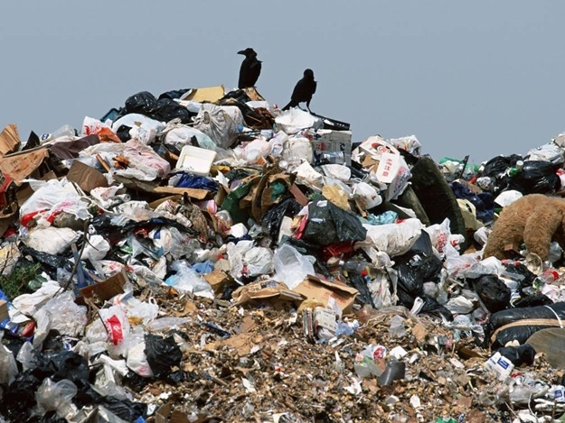

**109/365** Germania nu a fost întotdeauna o ţară curată. Pentru a o face astfel, a fost nevoie de măsuri aspre. Un timp îndelungat, oamenii aruncau gunoiul pe unde nimereau, astfel că oraşele erau murdare iar bolile infecţioase o normalitate.
În secolul al 15-lea, conducătorii Württembergului au început a adopta legi ca să oblige oamenii să arunce gunoiul în locuri mai depărtate de oraş, şi doar noaptea. Totuşi, aceste legi nu au avut practic niciun efect. După un timp a fost adoptată altă lege care a avut efectul scontat. Legea spunea că dacă cineva vedea că vecinul său nu aruncă gunoiul şi nu-şi face curăţenie în ograda sa mai mult de două săptămâni, ambii să fie amendaţi, iar dacă cineva îşi reclama vecinul, acesta avea dreptul la o parte din terenul lui. Astfel, în fiecare sâmbătă, toţi oamenii făceau curăţenie în ograda sa, temându-se ca să nu fie reclamat de vreun vecin care ar visa la o parte din terenurile sale. Chiar dacă metoda pare a fi una contradictorie, aceasta a făcut din Germania o ţară curată, precum o ştim astăzi.

