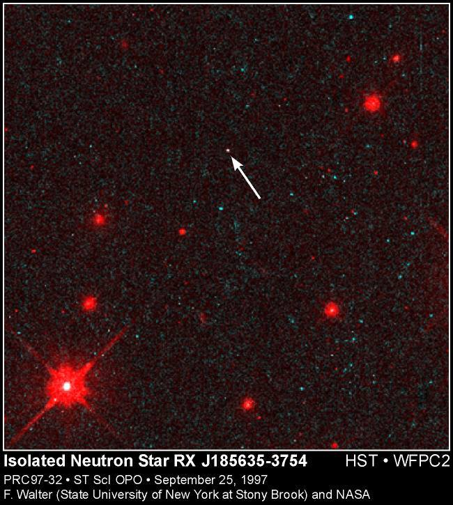

**11/365** Steaua neutronică ia naştere în urma exploziei supernovei, o stea de mărimi medii. Odată ce o supernovă îşi consumă combustibilul, aceasta explodează, iar cea mai mare parte a materiei se pierde în spaţiu, iar ceea ce rămâne colapsează şi se formează stelele neutronice, care au un diametru aproximativ de 22km, dar cu o masă mai mare ca a soarelui de circa 1,5 ori. Din cauza că acest tip de stele, emană foarte puţină lumină, găsirea lor este una dificilă, şi se datorează în mare parte fasciculelor perche de unde radio. Interesant este faptul că densitatea acestor stele este atât de mare, încât o părticică de mărimea unui fir de nisip ajunge să cântărească mai bine de 500 de mii de tone.

