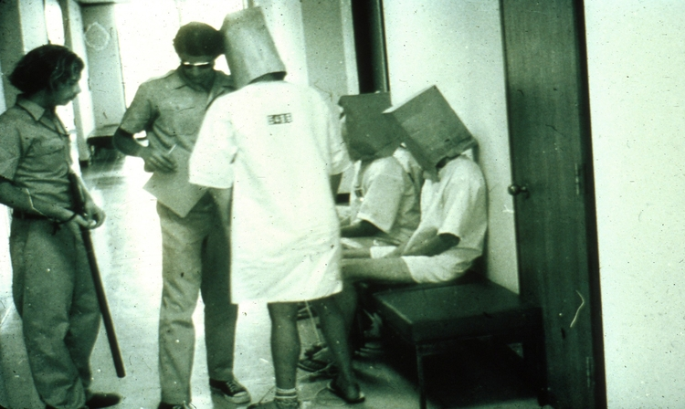

**110/365 Experimentul Stanford (Stanford Prison Experiment)** iniţiat în 1971 de către Philip Zimbardo pentru a studia schimbarea comportamentului în condiţiile de viaţă dintr-un penitenciar. A fost finanţat de către Oficiul American Naval de Cercetare sub forma uni anchete cu privire la cauzle de conflict dintre gardienii militari şi prizonieri. Li s-au explicat că vor participa la o simulare de închisoare pe o perioadă de două săptămâni. Din 75 de participanţi la selecţie, au fost aleşi 24 de studenţi, toţi de sex masculin, care au fost consideraţi cei mai stabili psihic şi sănătoşi, din clasă socială mijlocie. iar rolurile au fost alese aleatoriu. 12 dintre ei urmau să fie gardieni, iar ceilalţi 12 - prizonieri. Închisoarea simulată se afla la subsolul clădirii de psihologie "Jordan Hall" al universităţii Stanford. Participanţii s-au adaptat la rolurile sale dincolo de aşteptările lui Zimbardo. Gardienii aplicau măsuri autoritare şi îi supuneau la tortură psihologică, iar cu o zi înainte de a începe experimentul aceştia au fost îndrumaţi să nu le dăuneze fizic prizonierilor. Cercetătorii le-au furnizat gardienilor bastoane de lemn, îmbrăcăminte similară cu cea a paznicilor reali, ochelari relectorizanţi pentru a preveni contactul vizual. Deţinuţii la rândul său purtau haine inconfortabile şi lanţuri în jurul gleznelor. Prima zi a fost relativ lipsită de evenimente, mai apoi, în ziua a doua, prizonierii dintr-o celulă au bolcat uşa cu păturile, iar gardienii i-au atacat cu stingătoare de incendiu. După doar 36 de ore, unul din deţinuţi a avut o criză nervoasă şi a început să ţipe, să înjure, şi a fost nevoie de ceva timp pentru Zimbardo să-şi dea seama că suferea cu adevărat şi a fost eliberat. Condiţiile sanitare erau în declin rapid, deţinuţii fiind obligaţi să urineze şi defecheze în găleţi de salubritate, iar ca pedeapsă, aceştia nu erau lăsaţi să le golească. Au fost eliminate saltelele, iar deţinuţii dormeau pe ciment, iar unii din ei au fost forţaţi să se dezbrace, ca o metodă de degradare. Unii paznici deveneau tot mai cruzi în timp ce experimentul era în proces de desfăşurar şi s-au supărat că experimentul a durat doar şase zile. În cea de-a şasea zi, Christina Maslach, o absolventă în psihologie a obiectat condiţiile din închisoare, iar Zimbardo a remarcat că din cei peste 50 care urmăreau experimentul, doar ea a pus la îndoială moralitatea acestuia. După şase zile, acesta a fost oficial stopat. Experimentul l-a afectat profund chiar şi pe Zimbardo, care în calitate de administrator a permis abuzul psihologic, iar experimentul a fost oprit doar după şase zişe. Unele porţiuni ale experimentului au fost filmate, iar imaginile sunt disponibile pentru public.
Pe baza acestor fapte, au fost filmate două filme artistice Das Experiment (2001) şi The Experiment (2010).

