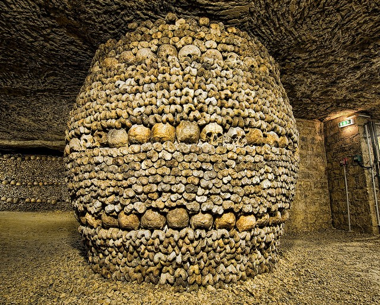

**111/365** 280km de catacombe pline de oseminte umane. Câteva secole în urmă, pentru a extinde suprafaţa Parisului, osemintele a peste şase milioane de oameni au fost aranjate în câteva nivele, pentru a elibera cimitirile de răposaţi. În 1876 "muzeul" a fost deschis publicului larg şi este la sigur unul din cele mai înfricoşătoare locuri pe care-l puteţi vedea în capitala Franţei.

