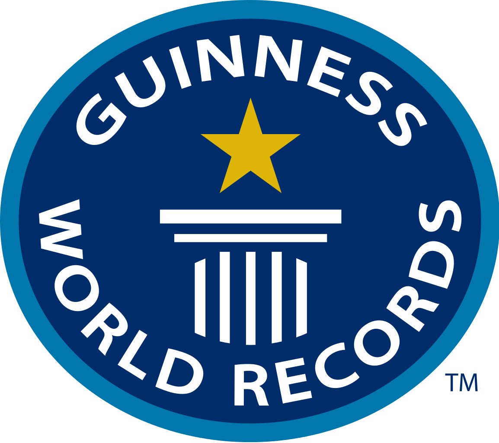

**114/365 Cartea recordurilor Guiness** sau Cartea recordurilor mondiale este un anuar care povesteşte despre recordurile oamenilor, a animalelor, a fenomenelor naturale, mass media, cultură şi altele. A fost publicată pentru prima dată în anul 1955 la comanda berăriei irlandeze Guiness. Ideea îi aparţine lui Hugh Beaver care a dorit să creeze pentru vizitatorii berăriilor o publicaţie cu informaţii veridice cu privire la unele lucruri. Această idee i-a venit după ce în 1951, în timp ce se afla la o vânătoare, şi-a pus întrebarea dacă covicla sau potârnichea sunt cele mai rapide păsări din Europa. După câteva cercetări, şi-a dat seama că nu există date concrete. Prima publicaţie a fost cea mai vândută carte din Marea Britanie până la Crăciunul din acel an. Iniţial, cartea includea doar date ştiinţifice, dar cu timpul au început să apară tot mai multe informaţii extravagante sau chiar stranii. Totodată, şi autorii cărţii atrăgeau persoanele doritoare de a ajunge pe paginile cărţii. De-a lungul istoriei sale, cartea a fost atât criticată, cât şi lăudată, iar la moment, conform autorilor, este cea mai vândută carte protejată de drepturile de autor, şi este cartea care estea cea mai furată din bibliotecile publice. Toate informaţiile apărute în carte, sunt verificate cu minuţiozitate, iar orice persoană care vrea să stabilească un record, se consultă cu reprezentanţii cărţii.

