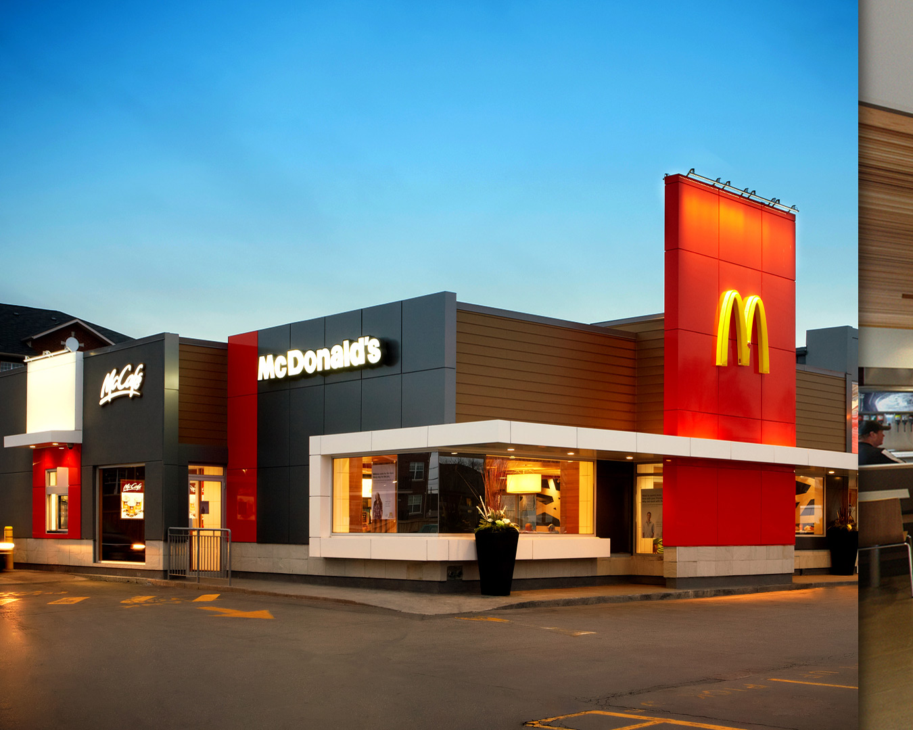

**115/365 McDonald's** este probabil una din cele mai cunoscute companii cu peste 32.000 de localuri în întreaga lume, şi cu un venit de peste 27 miliarde de dolari în 2011. Afacerea a început în anul 1940, când fraţii  Richard James "Dick" McDonald şi Maurice James "Mac" McDonald au deschis un restaurant la San Bernardino, California. În 1954 Ray Kroc a cumpărat de la fraţii McDonald drepturile de a deschide un restaurant franciză, iar mai târziu şi drepturile totale asupra companiei şi a extinso în întreaga lume. Restaurantele se găsesc în peste 120 de ţări din lume şi servesc aproximativ 54 de milioane de clienţi zilnic. Majoritatea restaurantelor oferă servicii direct în maşină sau servire în local. De obicei, restaurantele care se află lângă autostrăzi, oferă doar servicii în maşină, iar cele din oraşele aglomerate, în mare parte oferă doar servicii în local. Unele din ele oferă şi un spaţiu amenajat pentru copii.
Compania este des criticată pentră că ar produce mâncare nesănătoasă. Totuşi, în ultimul timp compania a introdus în meniurile sale salate şi fructe.
McDonalds mai este cunosct şi pentru procesele sale legate de marca înregistrată. Unul din astfel de procese a fost intentat împotriva unei cafenele scoţiene McDonald care fusese înfiinţată cu un secol înainte ca să apară compania McDonald's.
Interesant este şi faptul că după mai bine de zece ani de pierderi anuale în Bolivia, McDonald's şi-a închis toate restaurantele din această ţară. Bolivienii, din cauza culturii sale culinare au respins mâncarea fast-food ca una nesănătoasă. Aceştia cred că mâncarea trebuie pregătită încet şi cu dragoste, nu rapid şi pentru profit.

