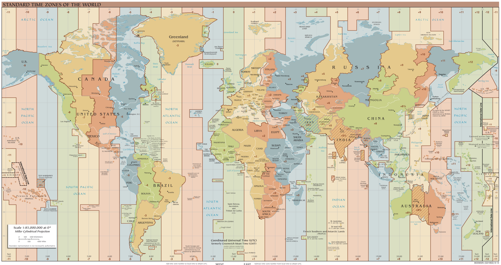

**116/365** Cu mai puţin de 200 de ani în urmă, fiecare oraş şi sat încă îşi avea ora sa locală. Necesitatea ca ora să fie sincronizată abia apărea, iar cei mai afectaţi de această situaţie erau marinarii şi căile ferate. Spre exemplu, între timpul Londrei şi cel al Plymouth-ului se înregistra o diferenţă de 16 minute, iar acest fapt începea să ridice mari inconveniente unor instituţii precum căile ferate, telegraful şi poşta. Lipsa sincronizării ceasurilor unor conductori a generat accidente provocate de coliziunea unor trenuri. În SUA, un astfel de accident a avut loc în 1853 şi s-a soldat cu 14 morţi. Astfel, căile ferate a fost instituţia care a impus nişte reguli - uniforme, clădiri, semnale, şi desigur sincronizarea tuturor ceasurilor existente în gări, precum şi obligativitatea pentru fiecare angajat de a avea un ceas pentru a şti timpul exact.

La 13 octombrie 1884, o delegţia din 25 de ţări s-au întâlnit la Washington pentru a conveni unui reper privind măsurarea timpului. Atunci au şi convenit să fie stabilit ca referinţă, meridianul zero care trece prin cartierul Greenwich, Londra.
În timp ce GMT (Greenwich Mean Time) are la bază rotaţia pământului, sistemul UTC (Coordinated Universal Time), introdus în 1970 se bazează pe timpul atomic, mult mai precis şi capabil să elimine influenţa variaţiilor din rotaţia Pământului.

Rusia reprezinta un caz aparte al planetei sub acest aspect. Ea se întinde pe 9 fuse orare. Pentru o coordonare internă, acolo s-a introdus un nou criteriu local, numit "Ora Moscovei", in diferitele regiuni practicându-se ora locală. Astfel, intr-un oras din Siberia indepartată, instituţiile folosesc dubla masură a timpului: ora Moscovei si ora locală.
Cea dintâi este utilă pentru comnicările telefonice între diferitele zone ale ţării, dar şi în transporturi, iar cea de a doua în relaţiile directe între cei locali.

