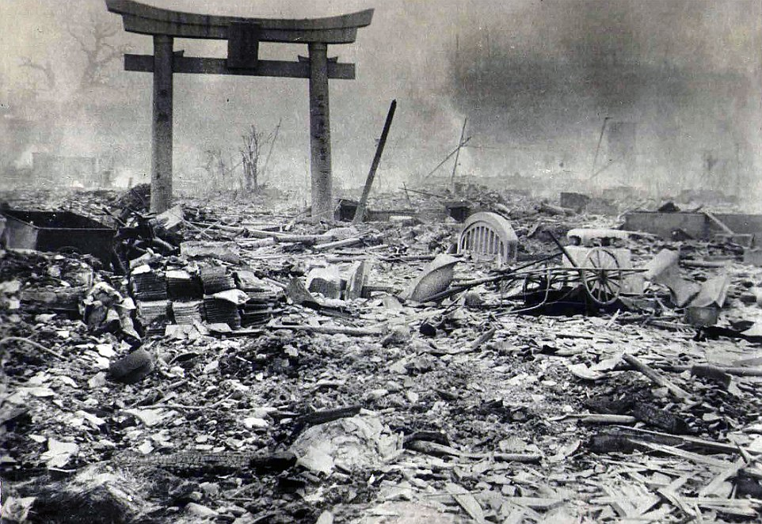

**118/365** La 12 aprilie 1945, Harry S Truman devine preşedintele Statelor Unite ale Americii, iar peste doar trei luni, acesta a fost nevoit să ia una din cele mai dificile decizii din istorie. La conferinţa de la Postdam s-a anunţat că bomba atomică era gata pentru a fi utilizată într-un atac împotriva Japoniei, iar după o discuţie lungă, Truman a decis să să atace Japonia. Bomba a fost aruncată peste oraşul Hiroşima la 6 august 1945, iar circa 70.000 de oameni au fost omorâţi. Acest fapt nu a fost doar începutul unei noi perioade în istorie, ci şi unul din factorii principali în începutul Războiului Rece.

