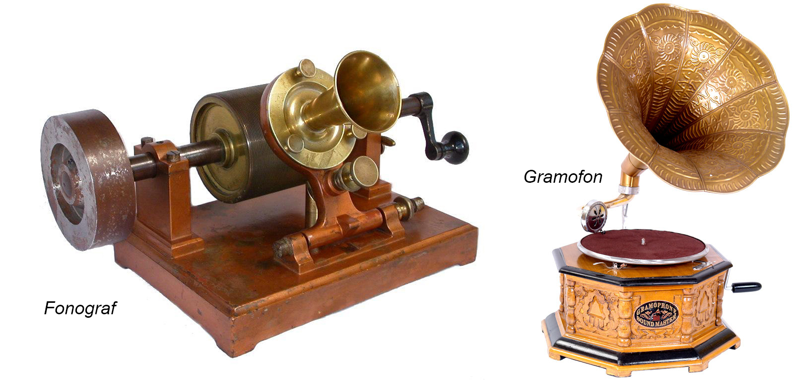

**119/365** În 1877, marele inventator Thomas Edison (1847-1931) a demonstrat pentru prima dată un **fonograf**. Această maşinărie permitea imprimarea sunetelor şi consta dintr-un cilindru care era plasat pe un tub din aluminiu. Undele sonore erau înscrise cu ajutorul unui ac care atingea tubul, inţial neted. După ce sunetele erau imprimate, acelaşi ac le "citea" şi puteau fi auzite de către ascultători. Gramofonul, spre deosebire de fonograf, folosea un disc orizontal şi a fost inventat în anul 1887 de către Emile Berliner (1851-1920). Până la inventarea vinilului în 1948, pentru crearea discurilor se folosea şelac - răşină naturală de origine animală.

