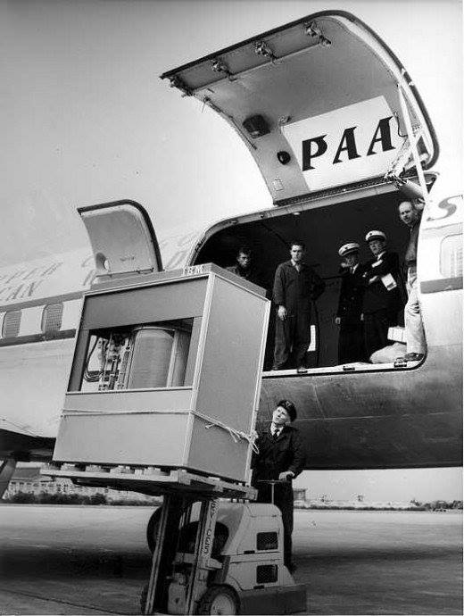

**12/365** În 1956, IBM lansează compiuterul 305 RAMAC, care era dotat cu HDD cu capacitatea de 5MB. HDD-ul cântărea peste o tonă, era format din 50 de discuri cu un diametru de 24inch (61cm), iar fiecare disc stoca 500kb şi se rotea de aproximativ 1200 de ori per minut. Interesant este faptul că HDD-ul nu era disponibil pentru a fi cumpărat, ci era dat în arendă, iar plata lunară costa în jur de 3,200$, ceea ce ar însemna peste 22.000$ la ziua de azi! La moment, există spaţii de stocare (MicroSD) cât unghia unui matur ce cântăresc doar câteva grame, costă doar circa 30$ şi stochează până la 128GB informaţie, ceea ce ar fi de peste 26.000 de ori mai mult!

