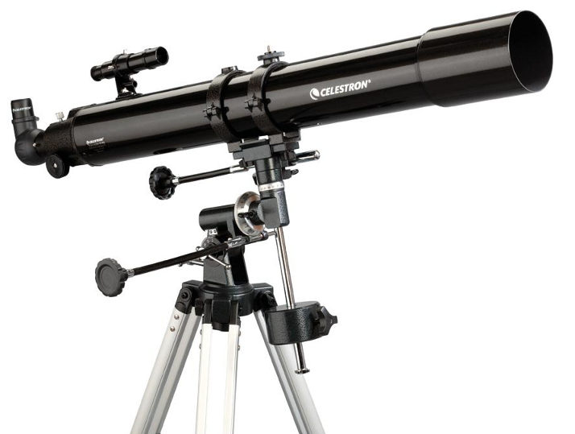

**122/365** Progresul ştiinţei s-a datorat invenţiei şi dezvoltării instrumentelor. Telescopul a fost inventat în anul 1608 de olandezul Hans Lippershey ca un dispozitiv de recunoaştere militară. Galileo l-a modificat peste un timp şi a schimbat radical înţelegerea universului. Telescopul a fost una din primele tehnologii care a stat la baza necesităţii de a pune la îndoială orice, când fiecare aspect al ştiinţei trebuia investigat totalmente. Cu ajutorul telescopului, Galileo a reuşit să observe sateliţii Jupiterului, fazele Venerei şi relieful Lunii. Astăzi, datorită telescopului, oamenii de ştiinţă au reuşit să răspundă la o mulţime de probleme legate de cosmos. Imaginile primite cu ajutorul telescopului Hubble, permite observarea corpurilor cereşti la o distanţă de peste 20.000 de ani lumină.

