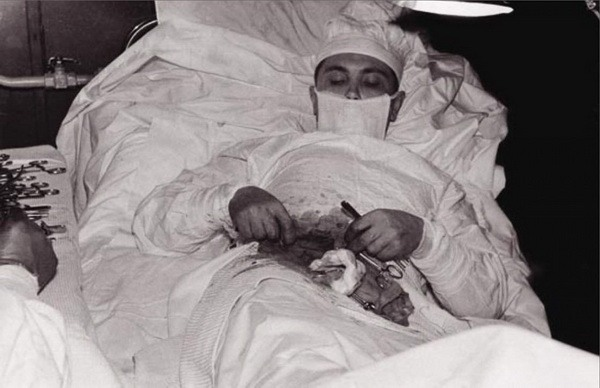

**123/365** În anul 1961, în timpul celei de-a şasea expediţii sovietice în Antarctica, din cauza unei situaţii deznădăjduite, tânărul doctor Leonid Rogozov s-a operat singur pe sine. Acesta şi-a diagnosticat un atac de apendicită acută, iar în cazul acestei boli, fiecare oră este foarte importantă, pentru că bolnavul se simte din ce în ce mai rău. Problema în acest caz consta în faptul că în afară de Leonid, prin apropiere nu mai era niciun doctor, iar unica soluţie era să se opereze singur pe el, cu ajutorul câtorva persoane de la staţia unde lucrau. Operaţia a avut loc noaptea la 30 aprilie 1961, unul din lucrători îi dădea instrumentele de care Leonid avea nevoie, iar un inginer ţinea oglinda, ca doctorul să vadă locul pe care-l opera. Un al treilea era de pază, în caz că vreo unuia din asistenţi o să i se facă rău. Culcat într-o poziţie pe cât se poate de comodă, Leonid şi-a făcut o injecţie de anestezic şi cu ajutorul bisturiului şi-a făcut o tăietură de 12cm în zona cu pricina.
Leonid povestea mai târziu, că în timpul operaţiei nu-şi permitea să se gândească la nimic în afară de ce era necesar. În caz dacă avea să-şi piardă cunoştinţa, unul din asistenţi a fost instruit să-i facă o injecţie. Leonid mai povesteşte că asistenţii săi erau palizi, dar totuşi chiar şi el era speriat. Operaţia era dificilă din cauza că era incomod să vadă locul care trebuia operat, chiar dacă folosea oglinda. Acesta simţea slăbiciuni, iar la fiecare câteva minute lua o pauză pentru 20-25 de secunde. Când a ajuns să-şi taie apendicita, frica a pus stăpânire pe el, totuşi după 1 oră şi 45 de minute, intervenţia chirurgicală fu terminată. Peste cinci zile de la operaţie, temperatura doctorului s-a stabilit, iar peste două zile şi-a retras cusăturile. Careva complicaţii după intervenţie nu au fost. După ce s-a întors în octombrie 1962 la Sankt Petersburg, pe atunci Leningrad, Leonid a finisat cu succes studiile în domeniul chirurgiei şi şi-a dedicat toată viaţa chirurgiei.
Totuşi, acest caz nu este primul şi nici unicul. Spre exemplu, la începutul secolului XX, doctorul american Evan O'Neill Kane la fel şi-a operat apendicita. Acesta a vrut să demonstreze avantajul anesteziei locale în locul celei totale. În momentul intervenţiei chirurgicale, doctorul era înconjurat de alţi doctori, care în orice moment îl puteau ajuta în caz de necesitate.

