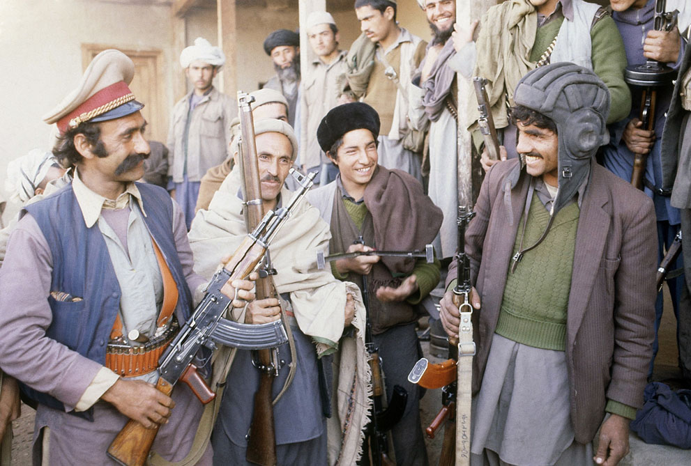

**124/365** La 25 decembrie 1979 armata sovietică atacă Afganistanul şi foarte curând preia controlul capitalei - Kabul. Totuşi, guvernul care era dependent de Uniunea Sovietică nu era agreat de majoritatea populaţiei, astfel forţele anti guvernamentale s-au intensificat, erau operate de la bazele din Iran şi Pakistan şi finanţate cu banii primiţi de la ţări precum Statele Unite ale Americii, Arabia Saudită, China şi Iran. Războiul a durat 10 ani şi s-a soldat cu retragerea trupelor sovietice de pe teritoriul Afganistanului, fiind înfrânşi. Numărul celor decedaţi nu se cunoaşte cu exactitate, iar din surse diferite, acesta este între 600.000 şi 2.000.000 de persoane, dintre care circa 14.500 erau soldaţi sovietici, 18.000 soldaţi afgani şi peste 90.000 de luptători mujahedini.

