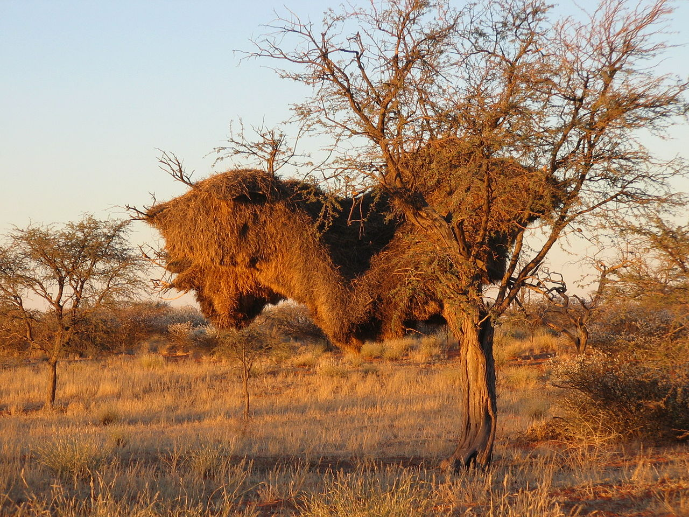

**125/365 Pasărea ţesătoare** este o pasăre relativ micuţă, cu lungimea corpului de circa 14 centimetri. Totuşi, pe cât ar putea suna de straniu, aceste mici păsări fac cele mai mari cuiburi, care ajung să aibă şi opt metri lungime şi până la doi metri înălţime. Această construcţie enormă uneşte de la 300 până la 500 de familii din diferite generaţii.
Cuibul este foarte bine structurat, astfel că cuiburile din interior sunt folosite pentru a înpota, iar cele din exterior, pentru odihna de zi. Temperatura în aceste cuiburi este de 7-8 grade cu plus, chiar dacă afară pot fi şi peste 30 grade de căldură.
Conveţuirea a atâtor păsări într-un cuib comun, necesită o organizare foarte bine pusă la punct, iar fiecare din păsări are rolul său bine stabilit. Ornitologii au descoperit că pentru a ţine totul sub control, se recurge la constrângere şi ameninţări. Ca şi în orice colectiv, există păsări un pic mai lenoase, care se străduie să se folosească de rodul muncii altora. Spre exemplu, în loc să aducă paie pentru construcţia cuibului, acestea pur şi simplu le fură de la vecini. Unele păsări încearcă chiar să ocupe cu forţa cuiburile străine. Pentru a preveni astfel de comportament, păsările prinse cu furatul, sunt pur şi simplu alungate cât mai departe posibil de cuib, acolo unde pot deveni o pradă foarte uşoară. "Căindu-se", acestea se întorc înapoi şi lucrează mai cu zel decât chiar păsările "ascultătoare".

