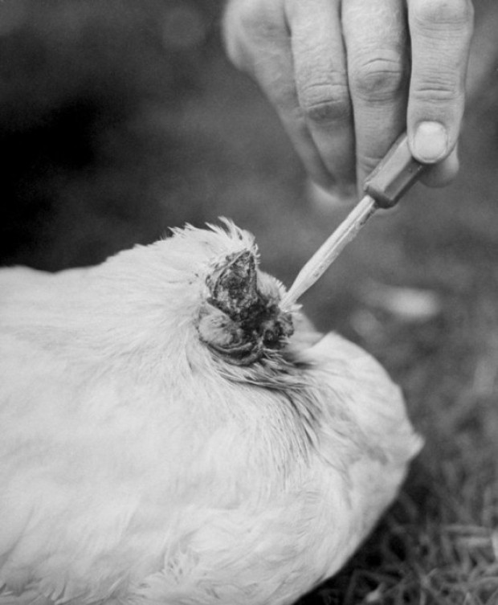

**127/365 Mike, cocoşul fără cap**, a devenit cunoscut după ce stăpânul său a dorit să prepare o supă şi i-a tăiat capul. Totuşi, cocoşul nu a murit din cauza că stăpânul său i-a tăiat doar o bucată de cap, creierul şi urechea stângă au rămas intacte, iar un cheag de sânge a oprit hemoragia. Văzând că cocoşul nu moare, Olsen şi-a promis că o să aibă grijă de pasăre până aceasta v-a muri de bătrâneţe. Astfel, acesta hrănea cocoşul cu ajutorul unei seringi. Cocoşul a devenit atât de popular, încât oamenii achitau câte 25 de cenţi doar ca să-l vadă, iar la un moment dat valoarea lui s-a ridicat la 10.000 de dolari şi genera cam 4.500$ lunar. Cocoşul a murit doi ani mai târziu, într-o cameră de hotel, înecându-se. Spre marea nefericire a altor păsări, mulţi americani au încercat să obţină cocoşi fără cap, dar nicio altă pasăre nu a supraveţuit la fel ca Mike.

