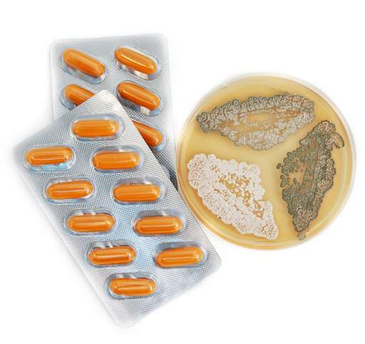

**128/365** În urmă cu 89 de ani a fost descoperită **penicilina**, antibioticul care a schimbat istoria omenirii şi cursul medicinii moderne. În anul 1928, Alexander Fleming s-a întors la muncă în laboratorul său, după ce petrecuse câteva săptămâni cu familia. În una din cutiile care conţineau culturi de stafilococ, care la acel moment reprezenta obiectul studiului său, crescuse o colonie de microorganisme de culoare albăstrie, iar în jurul ei, pe o rază de câţiva milimetri nu era nici urmă de stafilococ. Fiind un bacteriolog experimentat, acesta a înţeles că mucegaiul albastru conţinea ceva special care era capabil să distrugă stafilococul, bacteria patogenă care poate produce infecţii grave, inclusiv mortale. Totuşi, până când penicilina a fost gata de folosire, a fost nevoie de încă 12 ani. Fleming nu era specializat în chimie, aşa că nu era capabil să descopere cum poate fi folosită penicilina, aşa că a apelat la Dr. Howard Florey, de la Universitatea Oxford. Acesta deţinea relaţii importante şi putea obţine finanţări. Unul din cei mai buni angajaţi ai lui Florey a fost Dr. Ernst Chain, iar împreună, cei doi au produs o serie de culturi de mucegai din care au extras antibioticul minune. În anul 1940, în timpul unui experiment, 50 de şoareci au fost infectaţi cu streptococi mortali. Jumătate au murit, iar cei care au fost injectaţi cu penicilină au supraveţuit. Doctorii au ajuns la concluzia că au acumulato informaţiile necesare pentru a testa antibioticul pe oameni, însă, următoarea problemă consta în faptul că trebuia să cultive peste 2.000 de litri de cultură lichidă de mucegai. Astfel, un alt angajat important al lui Fleming, Dr. Normal Heatley, a creat o fabrică de mucegai. În anul 1941, Florey şi Heatley au părăsit Marea Britanie şi au mers în SUA, pentru a lucra cu oamenii de ştiinţă pentru a dezvolta un mod prin care medicamentul să fie produs în masă. Totuşi, soiul de mucegai Penicillium notatum nu putea produce suficientă substanţă curativă, aşa că oamenii de ştiinţă erau în căutarea unei specii de mucegai mai productivă. Într-o zi, un asistent a adus un pepene galben care era acoperit cu un soi de mucegai galben. Surprinzător, dar acesta s-a dovedit a fi Penicillium chrysogeum şi putea produce de 200 de ori mai multă penicilină. Mai apoi, specia a suferit modificaţii cu raze X şi a ajuns să producă de 1000 de ori mai multă penicilină decât mucegaiul descoperit de Fleming. Descoperirea era foarte binevenită, luând în considerare că omenirea se afla în toiul celui de-al Doilea Război Mondial, aşa că din mai şi pân în iunie, au fost produse 400 de milioane de flacoane cu penicilină, iar până la finalul războiului, companiile farmaceutice din SUA producea 650 miliarde de unităţi lunar. Potrivit unor calcule, de la descoperirea penicilinei, datorită antibioticului au fost salvaţi de la moarte peste 200 de milioane de persoane.

https://playtech.ro/2015/povestea-din-spatele-penicilinei-antibioticul-care-a-revolutionat-medicina-moderna/

