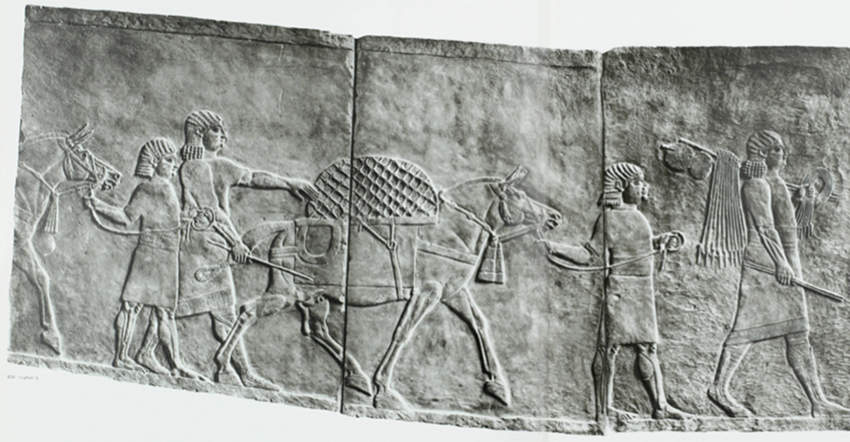

**129/365** Între perioada anilor 1700-500 înainte de era noastră, asirienii şi perşii controlau imperii politice şi militare. Succesul lor se baza în mare parte pe economie şi tehnologii avansate. Spre exemplu, construcţia sistematică a drumurilor permitea ca bunurile să fie transportate cu uşurinţă în orice colţ al imperiului, acolo unde soldaţii puteau rămâne gata pentru luptă pe un timp îndelungat. Vehiculele cu roţi nu doar că puteau folosi drumurile pentru a transporta provizii soldaţilor, dar totodată viteza de transportare era mai mare, cu cheltuieli mai mici şi pe distanţe mai lungi. Negustorii achitau o taxă pentru utilizarea drumurilor, care erau totodată şi mult mai sigure.

