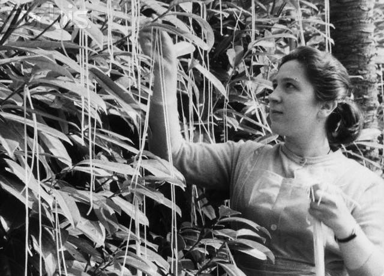
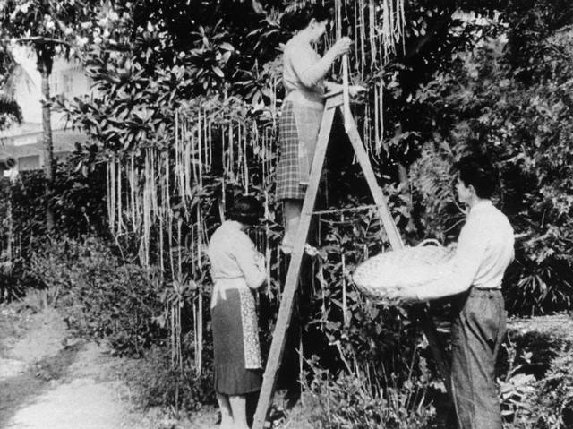

**13/365** La 1 aprilie 1957, emisiunea "Panorama" al postului de televiziune BBC, a prezentat un reportaj de câteva minute despre o localitate din sudul Elveţiei, în care oamenii ar cultiva spaghete, iar câţiva localnici demonstrau în faţa camerelor de luat vederi cum culegeau spaghetele de pe copaci. Interesant este faptul că la acea perioadă, oamenii aveau foarte mare încredere în televiziune, aşa că, după prezentarea emisiunii, câteva mii de persoane au scris scrisori la redacţie pentru a întreba de unde ar putea face rost de astfel de copaci, care sunt condiţiile în care cresc aceştia. Redacţia le răspundea tacticos să sădească câteva spagheti într-un borcan cu sos de roşii şi să spere că aceasta va funcţiona.

