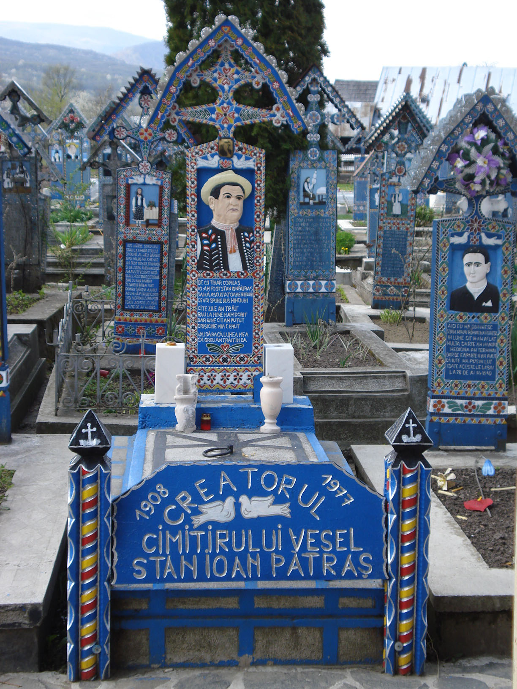

**130/365** În România, la Săpânţa, Maramureş, există un cimitir cu adevărat unic. Crucile mormintelor sunt viu colorate şi reprezintă scene din viaţa celui care odihneşte acolo. Pe unele din din ele, există chiar şi unele versuri umoristice, la fel, la adresa celui înhumat. Primul epitaf datează din anul 1935, însă din 1960, întregul cimitir a fost populat cu astfel de cruci, astvel devenind un loc de atracţie turistică şi muzeu în aer liber.

