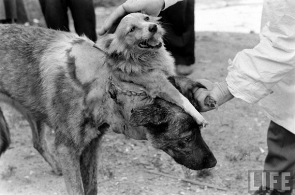

**131/365** În perioada Războiului Rece, când orice descoperire sau invenţie pentru oricare din părţi este foarte necesară, Stalin îşi îndreaptă atenţia spre medicină, cu intenţia de a accelera şi propulsa URSS asupra Statelor Unite. Astfel se pune baza unui complex de laboratoare medicale la Moscova, iar cercetătorii şi neurofiziologii selectaţi pentru proiect erau finanţaţi şi încurajaţi la experimente pe animale. Coordonatorul proiectului este numit Vladimir Demikhov, veteran în medicina militară. Iniţial, experimentele vizau îndepărtarea unor organe ale animalelor şi menţinerea acestora în viaţă cu ajutorul aparatelor, iar mai târziu transplantul de inimă şi plămâni între doi câini, demonstrând posibilitatea teoretică a unei intervenţii asemănătoare la oameni. Totuşi, cel mai important experiment a avut loc în anul 1954, când după o noapte de muncă cu echipa sa de chirurgi, Demikhov prezintă publicului o creatură desprinsă parcă dintr-un roman de groază. Aceştia cususeră capul unui câine de talie mică la gâtul unui câine de talie mare, conectându-l la vasele de sânge şi trahee. Propaganda sovietică şi-a proclamat zgomotos succesul.
Desigur că SUA nu putea rămâne în urma Uniunii Sovietice. Astfel, Robert White a fost angajat la un laborator special din Clevland, Ohio, unde a creat un centru de cercetare a creierului. În 1962, acesta reuşeşte să facă un transplant de creier de la un câine la altul, însă nu în cutia craniană, ci în zona gâtului. Creierul era conectat la circulaţia sanguină a animalului, dar şi la un sistem de electrozi pentru a i se monitoriza activitatea cerebrală. La 14 martie 1970, după o operaţie care a durat 18 ore, capul unei maimuţe era ataşat la o altă maimuţă. După ce şi-a revenit, capul maimuţei nu doar că-şi putea mişca musculatura facială, ci a şi încercat să-l muşte pe unul din membrii echipei, astfel manifestarea lui a confirmat viabilitatea capului transplantat şi reuşita operaţiei.

