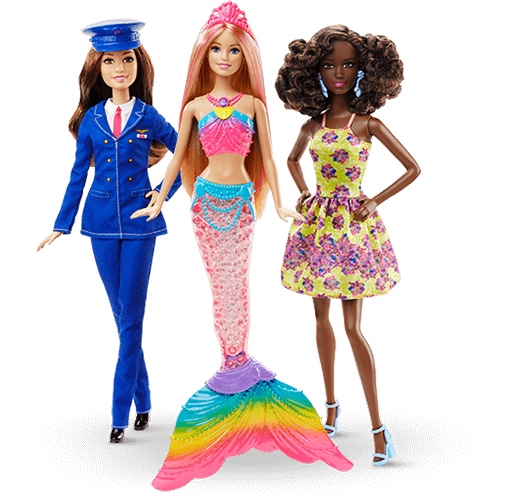

**132/365 Barbie** este la sigur cea mai celebră păpuşă din lume, şi totodată cea mai criticată, este personajul emblematic al culturii şi societăţii noastre. Părul blond, picioarele interminabile şi pieptul generos - anume astfel s-a remaracat la apariţia sa, acum 58 de ani, revoluţionând lumea păpuşilor cu chipuri de copii dolofani. A fost realizată de Ruth Handler, îi poartă numele fiicei acesteia şi a fost demonstrată la New York, la salonul de jucării la 9 martie 1959. În 1997 vânzările trecuseră de un miliard de unităţi. Pasiunea pentru Barbie s-a datorat pe universul personajului, cu familie, prieteni, care le permitea copiilor să-şi exerseze imaginaţia. Păpuşa a apărut în rol de manechin, infirmieră, balerină şi chiar astronaut. Totuşi, pe parcursul istoriei sale, păpuşa a fost urmată şi de multe controverse, precum că ar demonstra un stereotip al femeii - o europeană blondă şi slabă. Unii psihiatri au ajuns să afirme că Barbie este mai degrabă o fantasmă de adult decât o jucărie pentru fetiţe. Părinţii au acuzat-o că încurajează anorexia, iar oamenii de ştiinţă au ajuns la concluzia că dacă Barbie ar fi o femeie reală, ar cântări 49kg şi ar avea înălţimea de 175cm, şi ar trebui să meargă în patru labe, pentru că picioarele nu ar putea s-o susţină. În ultimii ani, compania Mattel a început a produce şi altfel de păpuşi Barbie - mai mică, mai plinuţă, 27 de nuanţe ale pielii, 22 de culori ale ochilor şi 24 de feluri de aranjare a părului, iar în anul 1980 a fost lansată şi comercializată Black Barbie, o păpuşă de culoare.

