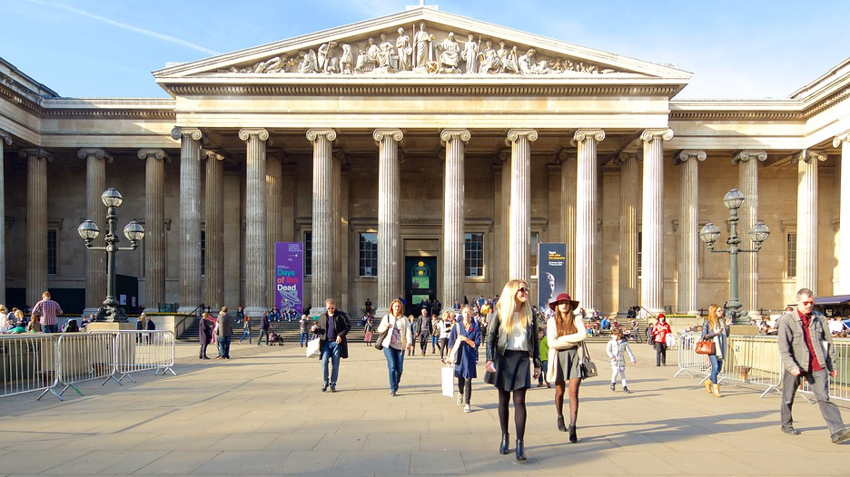

**133/365** În 1753, la Londra, este fondat unul din cele mai importante şi **primul muzeu public** din lume - British Museum. Exponatele variază de la mumii egiptene până la comori romane. Sir Hans Sloane a fost un colecţionar pe tot parcursul vieţii sale, iar înainte de moarte, i-a încerdinţat cele pete 70.000 de obiecte regelui George al II-lea în schimbul a 20.000 lire sterline care urmau să fie acordate moştenitorilor săi. La 7 iunie 1753 un act al parlamentului britanic stabileşte înfiinţarea muzeului. La 15 ianuarie 1759 muzeul a fost deschis publicului larg. Colecţia de atunci conţinea manuscrise, cărţi, câteva antichităţi. Astăzi, muzeul găzduieşte peste opt milioane de exponate şi este vizitat de peste şase milioane de persoane anual.

