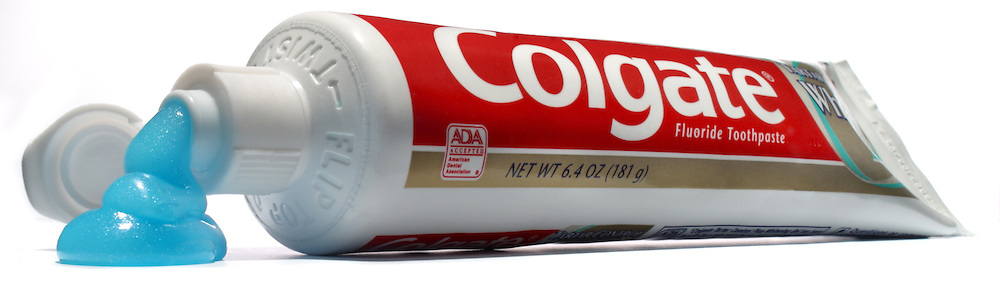

**134/365** Deşi **pasta de dinţi** în diferite forme a fost cunoscută încă din secolul al 4-lea î.e.n, conform unor manuscrise din Egipt, totuşi aceasta a început a fi folosită pe larg doar începând cu secolul al XIX-lea în Marea Britanie. La începtul anilor 1800, periuţa se folosea doar cu apă, iar ceva mai târziu, pudrele pentru dinţi au început a fi foarte populare. Totuşi, o enciclopedie din acea perioadă, avertiza că pudra face mai mult rău decât bine. Înainte de anii 1940, pasta de dinţi era comercializată în tuburi de plumb, şi chiar dacă erau cerate, plumbul oricum se amesteca cu pasta, ceea ce cauza diverse boli şi decese. Deja după al doilea război mondial pasta de dinţi se comercializa în tuburi de plastic, dar fiind dat faptul că membrii familiei foloseau doar o periuţă de dinţi, unele boli se mai transmiteau prin această cale.

