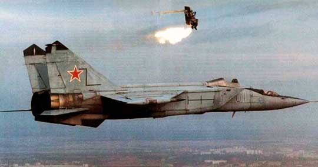

**136/365** La începutul secolului al XX-lea, experţii în aviaţie erau preocupaţi de avioane şi pilotarea acestora. Totuşi, Anastase Dragomir, un tânăr din România, s-a concentrat pe altă latură a aviaţiei, şi anume siguranţa aparatelor de zbor şi a pasagerilor acestora. Invenţia sa era un sistem de paraşutare din avioane, unde fiecare pasager avea o paraşută proprie care permite ca acesta, într-un moment critic, să părăsească aparatul de zbor printr-o deschizătură a podelei. În 1950, tot Anastae Dragomir obţine un nou brevet, pentru celula paraşutată, care presupunea ejectarea acestora, fie prin partea de sus, fie prin partea de jos a avionului. Această invenţie a reuşit să salveze între timp, mii de vieţi omeneşti.

