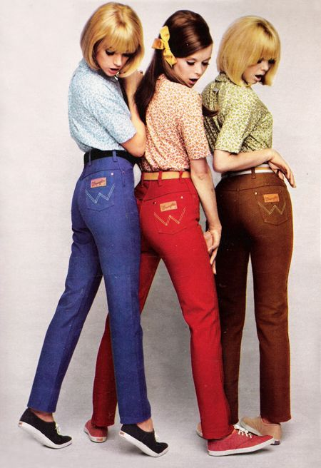

**137/365 Blugii** sunt probabil cei mai populari pantaloni, fiind  purtaţi şi de milionari şi de boschetari. Totuşi, iniţial aceştia au fost confecţionaţi şi comercializaţi în calitate de haine pentru lucru, fiind apreciaţi pentru ţesătura ieftină, confortabilă şi rezistentă. Denumirea blugilor vine din expresia franceză "bleu de Genes", ceea ce în traducere înseamnă "albastru de Genova". În acea perioadă, sfârşitul secolului XVI, ţesătura era confecţionată în Italia şi vândută în portul Genova pentru marinari. În anul 1847, un negostor evreu din Germania, Loeb Strauss a sosit la New York unde fratele său făcea afaceri cu ţesături şi haine. Strauss se implică şi el în afaceri şi vinde la California pantaloni blugi minerilor şi crescătorilor de vite. În 1872, Jacob Davis, unul dintre colaboratorii lui Strauss, a adăugat la buzunarele pantalonilor nişte ţinte metalice pentru a oferi acestora o mai bună rezistenţă. Între timp, blugii fiind destul de ieftini, au devenit foarte populari în SUA, iar la 20 mai 1873, Levi (îşi schimbase numele în 1850 din Loeb) Strauss şi Jacob Davis şi-au brevetat produsul. Desigur că o afacere atât de profitabilă nu poate rămâne fără concurenţi, precum Lee şi Wrangler, fiecare companie adăugând ceva deosebit pantalonilor.
În anii 1960 blugii devin un simbol al culturii pop şi hippy, şi tot în aceşti ani, aceştia au suferit cele mai multe schimbări, fie că erau pictaţi, fie că erau coloraţi, rupţi, ş.a.

