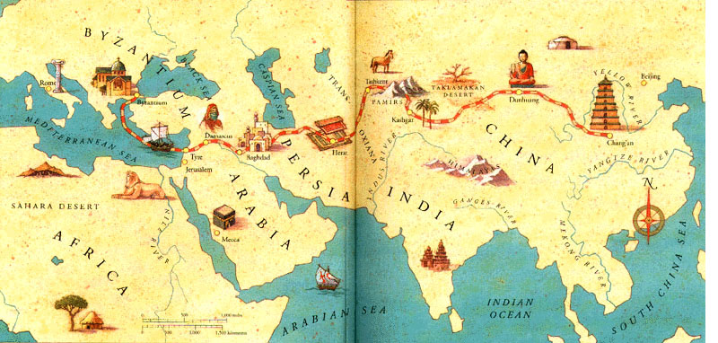

**138/365** Gloria **Drumului Mătăsii** a început să ia sfârşit începând cu secolul al XVI-lea, atunci când rutele maritime ajung să le umrbească pe cele terestre. Denumirea acestui drum era legată de principala marfă transportată, produsă în China, dar vândută Europei, Africii şi Orientului Mijlociu. Prima menţionare despre acesta apare în secolul II î.e.n., însă aceasta poate fi pur şi simplu o atestare a drumului care deja exista de sute de ani. Desigur că în afară de mătase, multe alte bunuri erau transportate pe acest drum - pietre preţioase, porţelan, stofe de in, fildeş, mirodenii, sticlă, arme ş.a. De-a lungul timpului, ruta a fost un punct important pentru cuceritori, iar oraşele care se aflau pe rutele principale, erau întotdeauna înfloritoare. Lungimea totală a drumurilor era de peste 6.000km, iar siguranţa acestuia era asigurată de diferite popoare, la răsărit de chinezi, la apus, într-o perioadă de Imperiul Bizantin, în secolul al XIII-lea siguranţa caravanelor era asigurată deja de Imperiul Mongol, dar doar pentru o perioadă scurtă, odată ce în anul 1262 începe destrămarea acestuia. În prezent, Drumul Mătăsii reprezintă o atracţie turistică.

