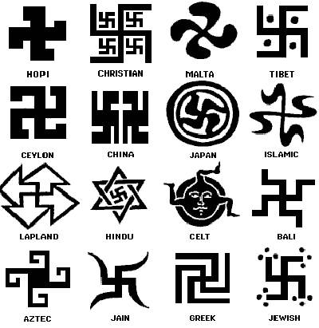

**139/365** Probabil unicul păcat al svasticii este că a plăcut fuhrerului, Adolf Hitler. Chiar dacă sute de milioane de oameni asociază acest simbol cu nazismul, istoria svasticii începe cu mii de ani în urmă. Nu se poate stabili cu precizie cine au fost cei care au folosit pentru prima dată simbolul, însă se pare că acesta a fost folosit în Mesopotamia încă în anul 3500 î.e.n. Svastica este un simbol sacru în hinduism, budism şi alte religii. Însuşi cuvântul svastică îşi are originea din sanscrită şi înseamnă obiect benefic sau obiec aducător de noroc. Interesant este faptul că svastica era cunoscut din timpuri vechi şi pe teritoriul actualei Românii, astfel acoperământul mormântului Mariei de Mangop, a doua soţiei al lui Ştefan Cel Mare, este împodobit cu svastici. Astăzi, simbolul este interzis în mai multe ţări, din cauza că este asociat cu simbolul nazismului şi al fascismului, totuşi în ţările asiatice acesta continuă să fie răspândit pe larg.

