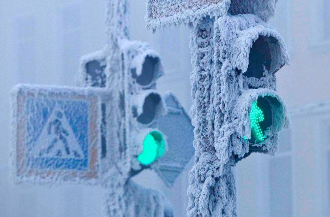

**14/365** Satul Oimiakon din Republica Saha, Federaţia Rusă, poate fi considerat unul din cele mai reci locuri de pe pământ cu populaţie permanentă. Astfel, în anul 1937, aici s-au înregistrat -67.7°C, fiind cea mai joasă temperatură în emisfera de nord. Doar Antarctica a înregistrat temperaturi mai mici, şi anume -89.2°C. Durata zilei în Oimiakon variază de la 4h 36m la 22 decembrie până la 20h 28m la 22 iunie. Vara este scurtă, cu temperaturi peste +30°C ziua, şi +10°C - +15°C noaptea. Interesant este şi faptul că denumirea satului în limba saha înseamnă "apa care nu îngheaţă" datorită unui izvor fierbinte.

