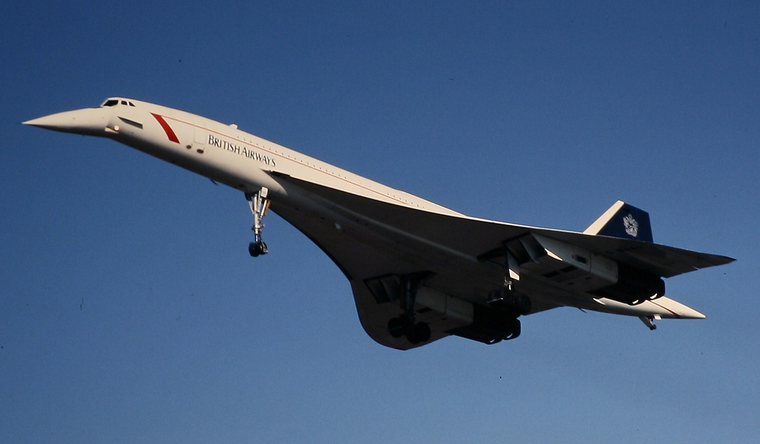

**141/365** Avionul **Concorde** a apărut datorită acordului încheiat între Franţa şi Marea Britanie, care prevedea fabricarea unui aparat de zbor supersonic care să transporte pe rute lungi circa 100 de pasageri. Tratatul a fost semnat la 28 noiembrie 1962, iar constrcuţia avionului începe în 1965. Primul exemplar, construit în Franţa, a efectuat primul zbor la 2 martie 1969, iar câteva luni mai târziu avionul depăşeşte viteza sunetului. Al doilea avion a fost construit în Marea Britanie şi a zburat pentru prima dată la 9 aprilie 1969. În total, au fost construite 20 de aparate, iar costurile dezvoltării proiectului au fost suportate de guvernele Franţei şi Marii Britanii. Concorde atingea o viteză medie de croazieră de circa 2.140km/h cu o altitudine maximă de 18.300 de metri, iar viteza de aterizare era de circa 298km/h. Discurile de frână ale avionului erau fabricate din ceramică, şi aveau nevoie de peste 1600 de metri ca să oprească avionul de 185 de tone, timp în care temperatura frânelor ajungea până la 500 de grade.
La 25 iulie 2000, zborul AIr France 4590 se prăbuşeşte în Franţa, omorând toţi cei 100 de pasageri, 9 membri ai echipajului şi alte 4 persoane la sol. Acesta a fost unicul accident cu victime al avionului Concorde, iar potrivit anchetei, accidentul a fost cauzat de o bucată de metal, căzută de la un alt avion, care decolase cu patru minute mai devreme. Acest fragment metalic a cauzat explozia unui cauciuc, iar o bucată din acesta a lovit rezervorul şi a rupt un cablu electric. Impactul a cauzat o undă de şoc, ce a dus la fisurarea rezervorului. Avionul a căzut peste un hotel din Gonesse. Cursele comerciale cu avioanele Concorde au încetat la 24 octombrie 2003, iar ultimul zbor a fost efectuat în noiembrie a aceluiaşi an.

