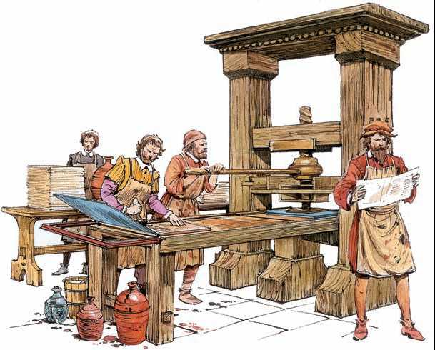

**142/365** Deşi inventarea tiparului îi este atribuită lui Johannes Gutenberg, totuşi, se pare că chinezii au folosit un astfel de mecanism pentru tipărirea cărţilor încă în secolul al XI-lea. Totuşi, tiparul cu caractere mobile din metal se pare că a fost inventat de coreeni în secolul al XIV-lea, de către Choe Yun. Cea mai veche carte tipărită care a ajuns până în zilele noastre se află la Bibilioteca Naţională a Franţei, la Paris şi datează din anul 1377. În preajma anului 1450, după mai mulţi ani de cercetări, Johannes Gutenberg reuşeşte să construiască primul tipar din Europa. Nu se ştie dacă acesta cunoştea despre tehnologiile coreenilor sau nu, dar cert este faptul că datorită lui a luat naştere revoluţia tipografică. Prima lucrare produsă în masă a fost Biblia lui Gutenberg.

