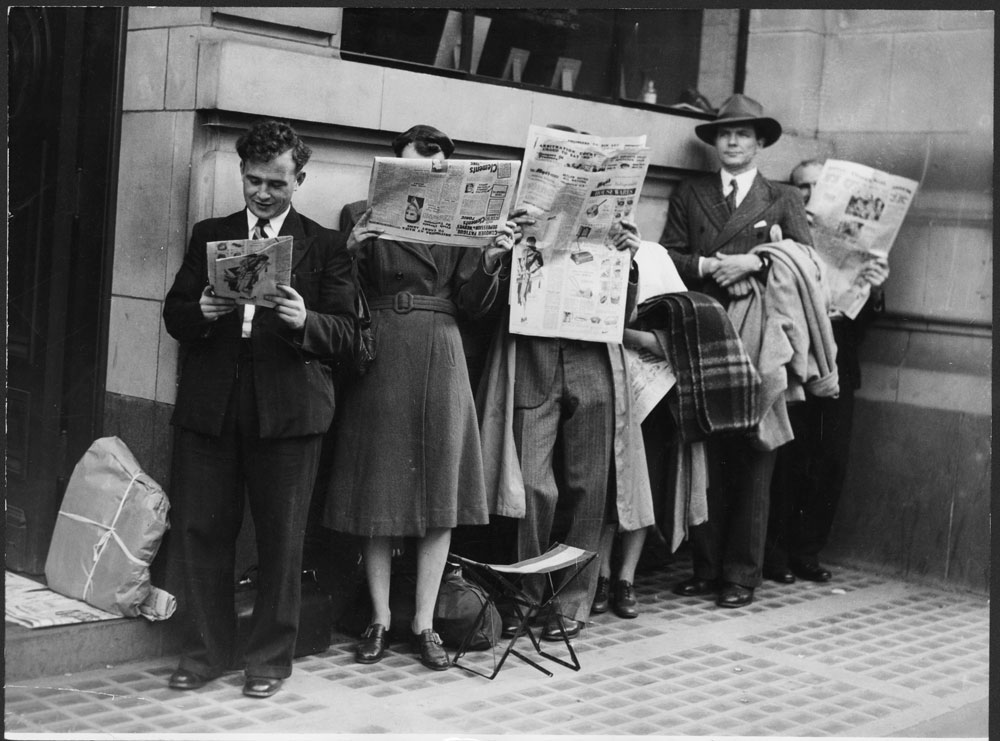

**143/365** Deşi tiparul a apărut abia prin secolele XIV-XV e.n., în Roma Antică, începând cu anul 59 î.e.n. ziarul Acta Diurna apărea zilnic în locurile publice aglomerate. Ziarul a fost înfiinţat de Iulius Cezar şi oferea informaţii referitoare la procese penale, execuţii, anunţuri, ştiri sportive şi culturale ce avea loc la Colosseum, adică nu se deosebea prea mult de un ziar din zilele noastre. Ziarele tipărite încep să apară în anul 1605 în Olanda şi în afară de anunţurile comerciale, conţinea comentarii socio-politice şi primele ştiri externe. Curând au început să apară şi alte ziare, iar începând cu anul 1620, acestea încep să fie traduse în franceză şi engleză. Tot în aceeaşi perioadă, la Londra, un domn pe nume Thomas Archer a editat un ziar, dar pentru că nu deţinea o licenţă, a fost arestat. Secolul al XVII-lea a marcat apariţie ziarelor în numeroase ţări, astfel una câte una, Austria, Franţa, Danemarca şi altele, îşi editează propriile ziare. Totuşi, pentru a cuceri publicul, a fost nevoie de câteva perioade, pentru ca importanţa informaţiei să atragă un public din ce în ce mai numeros, ca într-un final, în 1787, Edmund Burke, politic şi publicist să numească presa drept a patra putere.

