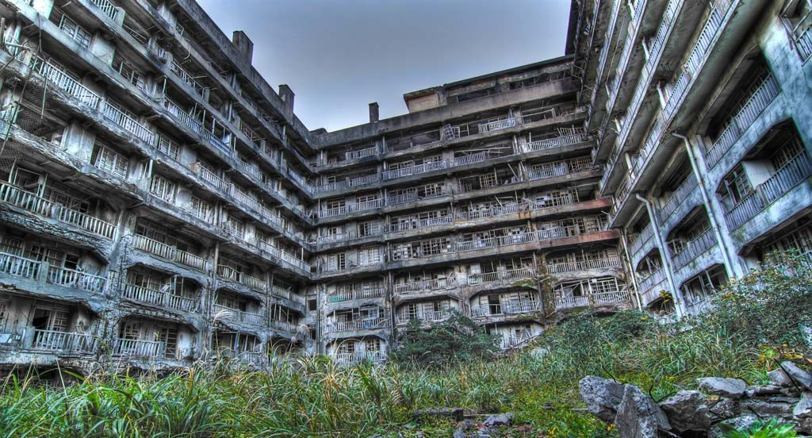

**144/365** În timp ce cartierul Kowloon bătea orice record imaginabil privind densitatea populaţiei, zeci, sau poate chiar sute de oraşe din întreaga lume sunt totalmentele lipsite de oameni. Cauzele sunt diferite, spre exemplu, Pripiati şi Cernobâl sunt practic pustii din cauaza avariei din 1986, iar alte oraşe precum Kadâcikan, din motive mult mai banale - închiderea minelor de cărbuni sau unei companii care nu mai generează profit. Totuşi, există şi unele motive un pic mai stranii, precum în Centralia, un orăşel din SUA, unde un pojar continuă deja de peste 40 de ani. În anii 1962, câteva grămezi de gunoi au fost incendiate şi nu au putut fi stinse pentru că focul s-a răspândit până a ajuns la minele de cărbuni aflate la adâncime. Din cauza fumului, oamenii au început să se îmbolnăvească, aşa că au început a părăsi oraşul, care în 1982 încă găzduia peste 1000 de locuitori, iar în 2012, numărul acesta era de doar 7 persoane. Apropo, oraşul Centralia a fost ales drept prototip pentru oraşul Silent Hill din jocul video cu acelaşi nume.
Desigur că nu putem trece cu vederea încă un motiv, şi anume războaiele. Astfel, oraşul Belchite din Spania, mai bine zis ruinele acestuia, au rămas drept mărturie al războiului civil din 1809. La fel şi oraşul Oradour-sur-Glane din Franţa, "eliberat" de oameni în timpul invaziei naziste în cel de-al Doilea Război Mondial.

