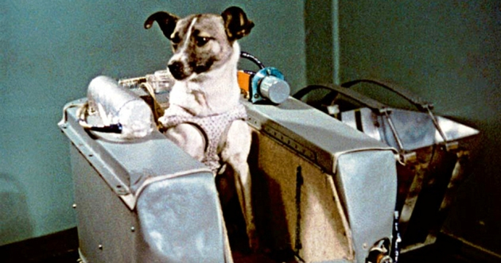

**146/365 Laika** a fost prima fiinţă care a zubrat în spaţiul cosmic, la 3 noiembrie 1957, la bordul navei "Sputnik 2". La acea dată, Laika avea vârsta aproximativă de doi ani. Nava cosmică nu a fost proiectată pentru a se putea întoarce pe Pământ, astfel, soarta câinelui era pecetluită, iar Laika a murit la circa 5-7 ore de la lansare, din cauza unor probleme tehnice ale unui modul. Totuşi, iniţial, se planifica ca Laika să fie eutanasiată, prin servirea unei porţii de mâncare otrăvită. Doar în 2002, Dimitri Maleshenkov, unul din savanţii misiunii "Sputnik 2" a dezvăluit cauzele şi data decesului. În decurs de şapte zile, URSS transmitea starea sănătăţii câinelui, care deja era mort, pentru a crea o impresie bună. Totodată, moartea câinelui a fost criticată intens de către asociaţiile pentru drepturile animalelor. Chiar şi Oleg Gazenko, care a participat la pregătirea Laikăi pentru zbor spunea mai apoi:
"Lucrul cu animalele este o sursă de suferință pentru fiecare dintre noi. Le tratăm ca pe copii ce nu pot vorbi. Cu cât trece mai mult timp cu atât imi pare mai rău. Nu trebuia să fi făcut asta... Nu am învățat suficient din această misiune pentru a justifica moartea câinelui."
Interesant este faptul că Laika era un câine vagabond de pe străzile Moscovei, astfel fiind adaptată pentru condiţii mai severe de viaţă. Datorită acestui zbor, a fost demonstrată posibilitatea fiinţelor vii de a călători în spaţiul cosmic, fapt care era pus la îndoială până la acea dată.

