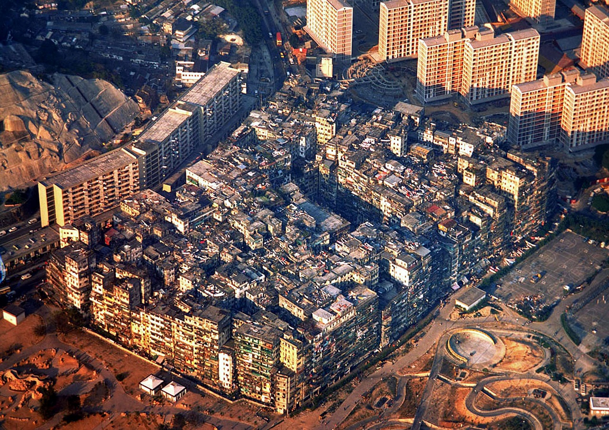

**147/365** În prezent, Macau este în fruntea clasamentului la capitolul densitatea populaţiei cu 21.236 locuitori per kilometru pătrat. Totuşi, în urmă cu doar 25 de ani, acest număr ar fi fost o glumă în comparaţie cu densitatea populaţiei în **Kowloon**, un fenomen unic în istoria omenirii. Înainte de a fi demolat, cartierul cu o suprafaţă de doar 2.6 hectare, găzduia cel puţin 33.000 de oameni, ceea ce ar însemna 1,255,000 oameni per kilometru pătrat. Deşi Hong-Kong-ul oficial era colonie a Marii Britanii, cartierul problematic nu se dorea a fi luat în calcul, astfel că în anii 1970, devine un loc preferat pentru grupările criminale. Tot mai mulţi oameni vin să locuiască în cartier, iar pentru a rezolva problema spaţiului locativ, etajele sunt construite peste cele vechi. Unica înţelegere cu autorităţile a fost aceea de a nu construi clădirile mai înalte de 45 metri, pentru ca avioanele care aterizau la aeroportul din apropiere, să fie în siguranţă. Deşi spaţiul devenea tot mai restrâns, numărul oamenilor continua să crească.
Pentru a asigura locuitorii cu apă potabilă, au fost săpate peste 70 de fântâni, iar cu ajutorul pompelor electrice, apa era pompată pe podul caselor, după care, printr-un labirint enorm de ţevi, ajungea în apartamente. Multe locuinţe erau conectate la energia electrică nelegal. Primul etaj a clădirilor era ocupat de diferite magazine, cabinete stomatologice, frizerii. Desigur că toate aceste afaceri nu aveau niciun fel de autorizaţii, astfel, cabinetele stomatologilor erau veşnic pline, pentru că puteau oferi preţuri joase, mai ales în comparaţie cu cabinetele stomatologice din afară, adică din lumea civilizată. Tot aici erau fabricate produsele alimentare, obiecte de uz casnic şi altele. În Kowlun existau chiar şi câteva şcoli şi grădiniţe, deşi totuşi de copii mai mici de obicei aveau grijă fie părinţii, fie fraţii mai mar. Unii copii ajungeau totuşi să înveţe la şcolile din Hong Kong. Din cauza spaţiului foarte restrâns, locul pentru socializare şi recreare era acoperişul caselor. Acolo se jucau copii, acolo se întâlneau tinerii, acolo oamenii în vârstă juca majhong. Nu lipseau din peisaj nici bordelurile, jocurile de noroc, drogurile. Toate aceste "afaceri" erau conduse de triade, care erau adevărata forţă în Kowlun. La mijlocul anilor '70, forţele de ordine ale Hong Kong-ului au organizat o serie de raiduri, după care au reuşit să alunge grupările criminale din cartier. Deşi cartierul arăta groaznic, totuşi, mediul era destul de liniştit. Tot în acei ani, cartierul a fost conectat la conducta de apă şi electricitate, şi chiar a început a fi distribuită poşta. În anul 1987, în sfârşit, Marea Britanie şi Republica Populară Chineză au ajuns la un numitor comun în privinţa cartierului, care trebuia să fie întors sub jurisdicţia Chinei în următorii zece ani. Astfel, administraţia britanică a primit învoria să demoleze cartierul. În anii 1992-1993, începuse procesul de demolare, iar locuitorilor fie li s-au oferit apartamente gratuite în clădirile proaspăt construite, fie bani. Char şi aşa, procesul de demolare nu a putut trece fără opoziţie şi proteste din partea a multor aborigeni, care nu erau gata să renunţe la acel stil de viaţă. Astăzi, în acel loc se află un parc, care la fel poartă numele de Kowlun.

