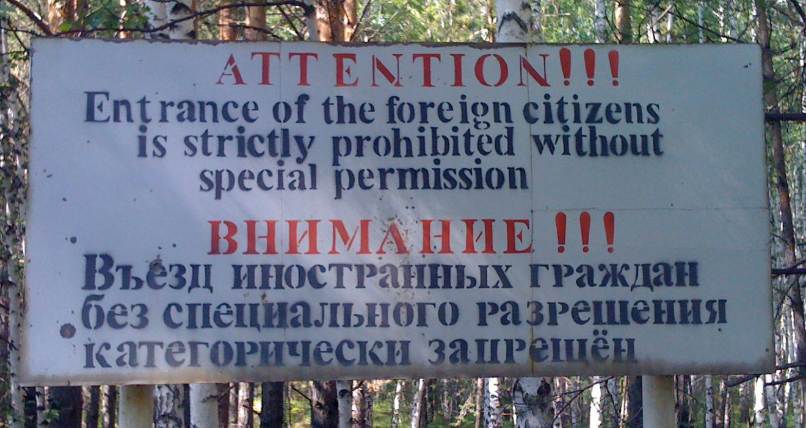

**148/365** În Uniunea Sovietică au existat cel puţin câteva zeci de **oraşe secrete**, care nu existau pe hartă, şi despre care ştia un număr foarte limitat de oameni. Unul din acele oraşe se numea Celiabinsk-65, astăzi Azeorsk, oraş care a fost desecretizat în anul 1986. Secretizarea acestui oraş era legată de aflarea unei fabrici de prelucrare a deşeurilor nucleare. Spre aceste oraşe nu existau drumuri, nu existau rute de autobuz. Accesul în astfel de oraşe se făcea doar cu acordul KGB-ului, iar locuitorii nu aveau contact cu persoanele din afară. Odată cu căderea URSS-ului, oraşele au fos desecretizate, deşi există suspiciuni că mai există încă şi astăzi câteva oraşe ferite de ochii lumii.

