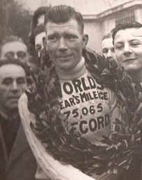

**15/365** Se pare că unele recorduri nu se dau bătute prea uşor, chiar şi peste zeci de ani de la stabilirea acestora. Spre exemplu, recordul pentru distanţa parcursă cu bicicleta într-un an, a fost stabilit tocmai în 1939 de către englezul Tommy Godwin, parcurgând o distanţă de tocmai 120.856km (cca 330km zilnic). Totuşi, peste 77 de ani, americanul Kurt Searvogel stabileşte un nou record de 122.432km, care probabil, ca şi recordul precedent, o să fie de neclintit încă vreo 77 de ani, din cauza distanţei enorme pentru un astfel de tip de transport!

