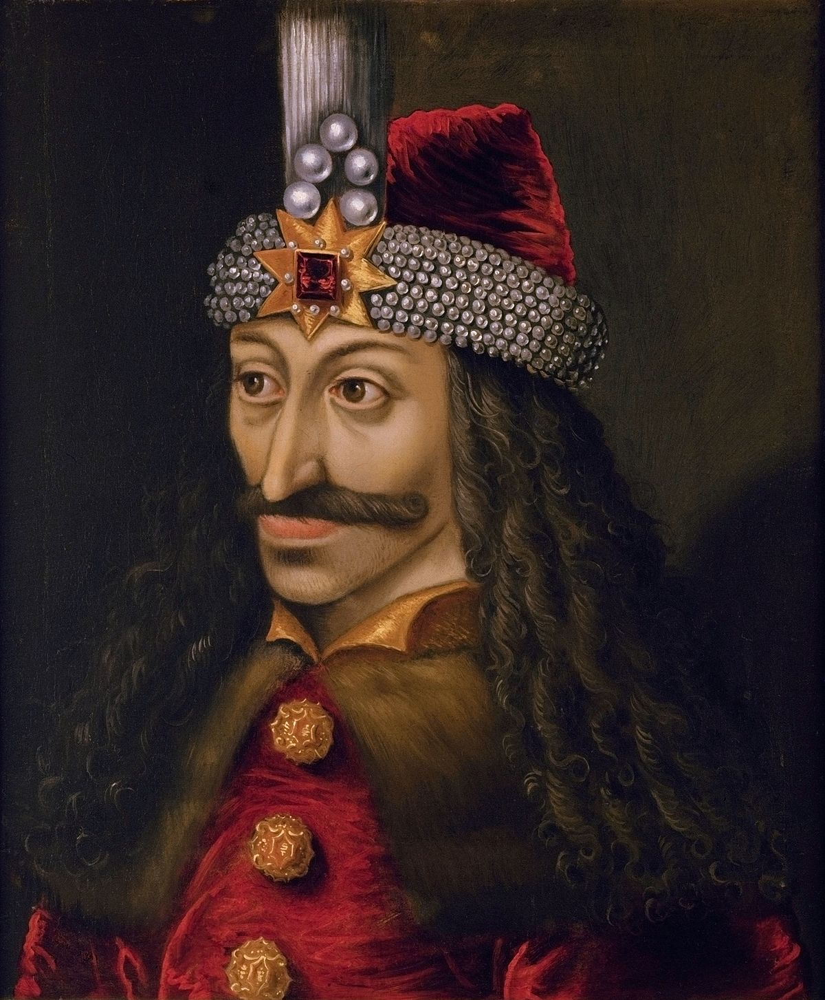

**150/365** Deşi majoritatea îl cunosc doar datorită legendelor şi sub numele de Dracula, **Vlad Ţepeş** a existat totuşi în realitate şi a fost unul din domnitorii Ţării Româneşti, iar prima domnie a lui Vlad Ţepeş începe în septembrie 1448. Totuşi, Vladislav al II-lea, protejatul lui Iancu de Hunedoara revine în ţară, după bătălia de la Kossovopolje şi îşi recapătă tronul. Ca urmare a înfângerii creştinilor la Kossovopolje, Vladislav al II-lea intră sub influenţa otomană, lucru de neacceptat pentru Iancu de Hunedoara, astfel, în 1456, Vlad Ţepeş revine la tron. În timpul acestei domnii, intră în conflict cu Sibiul şi Braşovul, din motive economice şi politice. Ambele oraşe adăposteau eventualii pretendenţi la tron, Dan - fiul lui Vladislav al II-lea şi Vlad Călugărul, fratele vitreg al lui Vlad Ţepeş. În 1457, intervine în Moldova în favoarea lui Ştefan cel Mare.
În 1462 reuşeşte să-i facă pe turci să se retragă din spaţiul românesc, nelăsându-i să-şi atingă scopul de a-l instaura la tron pe Radu cel Frumos. Chiar şi aşa, în ciuda victoriilor împotriva turcilor, la 26 noiembrie 1462, Vlad Ţepeş a fost arestat de ostaşii unguri. După 12 ani este eliberat, şi devine căpitan în armata regelui, iar la 16 noiembrie 1474 ajunge iar la tron. În scurt timp, în timpul unui atac turcesc, este asasinat de proprii oameni, care l-ar fi confundat cun un turc.
Numele de Dracul, purtată de tatăl lui Vlad Ţepeş, vine de la faptul că acesta era membru al Ordinului Dragonului, care avea ca scop lupta împotriva ereticilor şi a păstra valoarea catolicismului occidental. De la numele acestui ordin, apar tot felul de derivaţii, precum Dracula, Drăculea, Dragulia, Dracea. Astfel, unicul element comun al legendei medievale cu legenda modernă, născută graţie lui Bram Stoker, este numele Dracula, care accentua negativismul personajului. Izvoarele turceşti îl reprezintă rău şi crud, precum şi despre metoda de pedeapsă preferată: trasul în ţeapă, de unde şi i se trage numele de Ţepeş.

