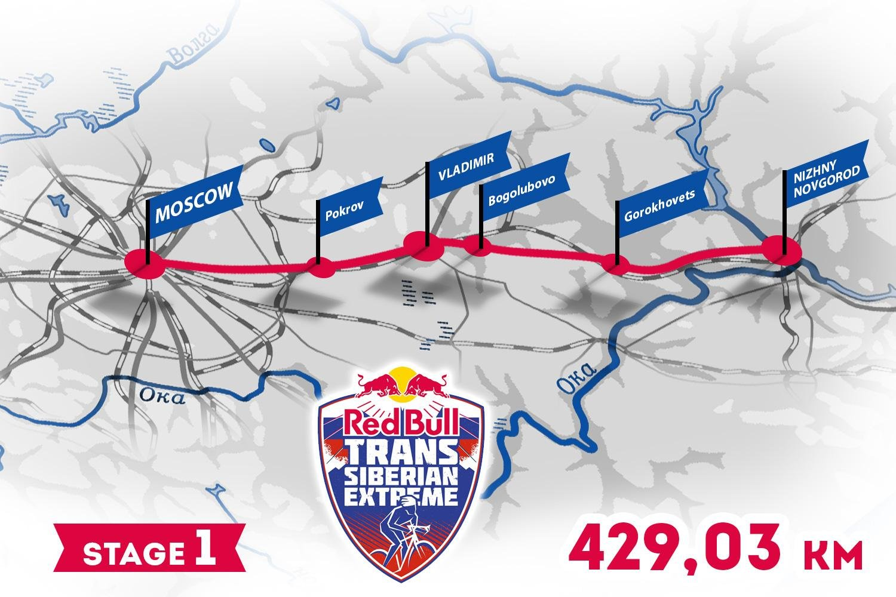

**151/365 Red Bull Trans-Siberian Extreme** este cea mai lungă cursă de ciclism şi a avut lungimea 9.287km în anul 2016. Cursa cuprinde 14 etape cu lungimea care variază între 300 şi 1.400km, iar participanţii au parcurs un traseu care leagă Moscova de Vladivostoc, trecând prin cinci zone climaterice diferite şi prin şapte fusuri orare, în imediata apropiere cu hotarele Kazahstanului, Mongoliei şi a Chinei. Toată distanţa a fost parcursă în 24 de zile, însă din cauza condiţiilor extrem de dificile, nu toţi participanţii au finisat cursa. Probabil în comparaţie cu cursa dată, Tour de France pare mai degrabă o plimbare prin parc.

