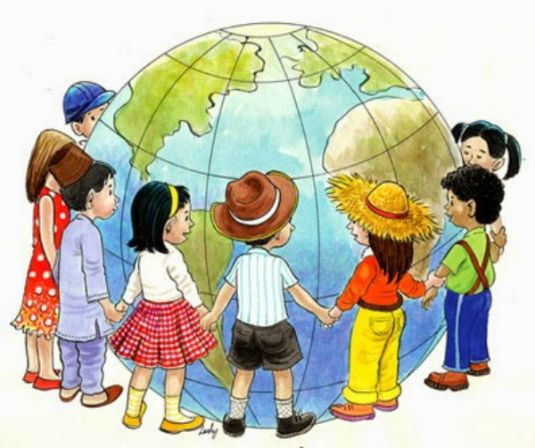

**152/365 Ziua Internaţională a Copilului** îşi are începuturile în anul 1925, când la Geneva s-a ţinut conferinţa mondială pentru bunăstarea copiilor. Însă, cu puţin timp înainte, la 23 aprilie 1920, Ziua Copilului a fost celebrată la nivel naţional în Turcia, şi doar în 1953, în luna octombrie, sărbătoarea a fost celebrată la nivel mondial! Totuşi, ziua de 1 iunie nu este o dată exactă când se celebrează Ziua Copilului, multe ţări celebrând în diferite perioade ale anului. De fapt, ziua de 1 iunie a fost aleasă în Uniunea Sovietică în 1949, astfel, unele ţări ale fostului bloc comunist serbează şi în continuare Ziua Copilului la această dată.
ONU a susţinut iniţiativa celebrării acestei sărbători şi a proclamat protecţia drepturilor, vieţii şi a sănătăţii copiilor. Declaraţia cu privire la drepturile copilului a fost aprobată la 20 noiembrie 1959 şi proclama dpreturi egale pentru copii la educaţie, asigurare socială, dezvoltare fizici şi spirituală indiferent de culoarea pielii, naţionalitate, situaţie materială şi altele.

