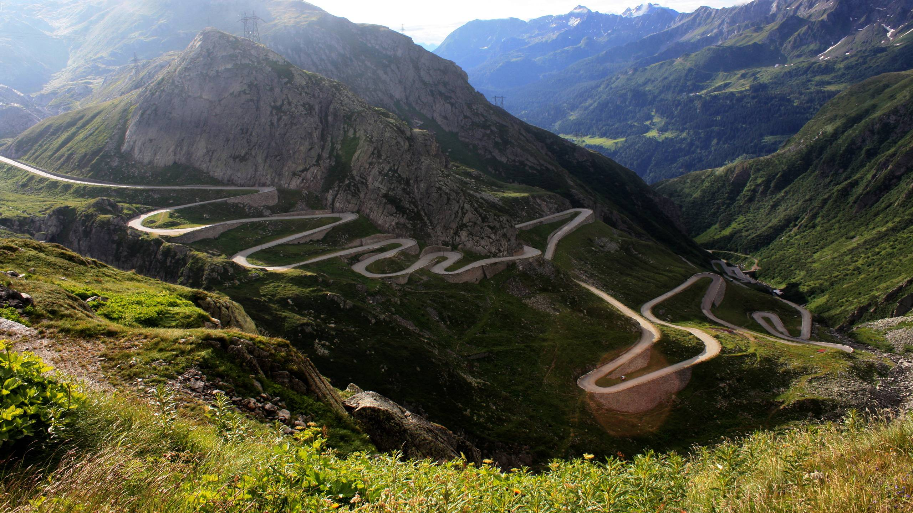

**154/365** Socotit drept unul din cele mai fascinante drumuri de munte, **Transfăgărăşanul** a fost construit între anii 1970-1974, la iniţiativa liderului comunist român, Nicolae Ceauşescu. După invazia Cehoslovaciei în 1968 de către trupele sovietice, este luată decizia de a crea o trecere între Sibiu şi Piteşti, pentru a lega strategic garnizoanele acestor două localităţi. Totodată, era planificat şi un tunel cu o lungime de 7km, pentru a evita zona de gol alpin, însă din cauza costurilor excesive şi a dificultăţilor de realizare, această propunere a fost abandonată. Proiectul aprobat iniţial prevedea ca drumul să aibă o singură bandă de circulaţie plus acostament, însă în 1971 se hotărăşte realizarea drumului conform normativelor de drum naţional în zonă montană. La construcţia drumului s-a lucrat toată perioada anului, procesul fiind îngreunat de climatul alpin la o altitudine de 1600m, cu vânturi puternice, viscole. Pe lângă costurile materiale considerabile, bilanţul oficial al celor care şi-au pierdut viaţa la construcţia drumului, se ridică la 40 de oameni. Totuşi, într-un interviu, unul din lucrători spunea "Numai la baraj au murit vreo 400 de băieți".
Inaugurarea a avut loc la 20 septembrie 1974 în prezenţa lui Nicolae Ceauşescu, iar lucrările de asfaltare au continuat până în 1980. Tot atunci, au fost ridicate şi inaugurate două monumente închinate militarilor care au contribuit inclusiv cu viaţa lor la construirea Transfăgărăşanului. Zona montantă înaltă a DN7C este deschisă doar în perioada 30 iunie - 1 noiembrie, din motiv că drumul este înzăpezit pe timp de iarnă şi există riscul de avalanşe şi căderi de pietre. Chiar şi aşa, când traseul este deschis, restricţiile cuprind şi perioada de întuneric (22:00 - 6:00), deoarece traseul este unul periculos, având deosebit de multe viraje, iar limita de viteză recomandată este de 40km/h. Când drumul este închis pe timp de iarnă, la Lacul Bâlea se poate de ajuns cu telecabina.

