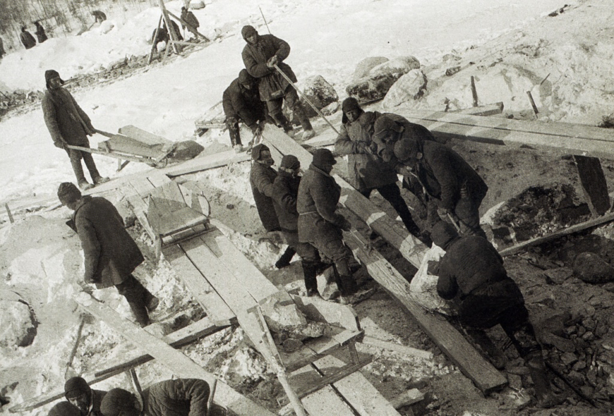

**155/365** În perioada comunismului, viaţa unui om de rând era egală practic cu zero. Astfel, dacă construcţia Transfăgărăşanului, moftul lui Ceauşescu, a luat cel puţin câteva zeci de vieţi, conform datelor oficiale, şi câteva sute conform datelor neoficiale, atunci Uniunea Sovietică era mai "darnică", iar numărul vieţilor pierdute pentru moftul unui alt dictator, Stalin, se ridică, conform unor date, până la 100.000. **Canalul** navigabil **Belomor** care uneşte Marea Albă şi Marea Baltică a fost inaugurat la 2 august 1933. Canalul este construit de-a lungul câtorva râuri şi a două lacuri, iar lungimea totală a acestuia este de 227km. Construit în doar 20 de luni, aproape în întregime prin muncă manuală, acesta a fost prezentat drept un succes. A fost folosită munca prizonierilor din Gulag, ca o metodă de reeducare a criminalilor prin muncă corecţională. Deşi Stalin a fost mândru de această lucrare, adâncimea maximă a canalului e de doar 3.65m, ceea ce-l face impracticabil pentru mai multe tipuri de vase, fiind folosit în special pentru traficul uşor. Totodată, în cinstea acestui proiect "eşec", a fost lansată şi marca de ţigarete Belomorkanal.

